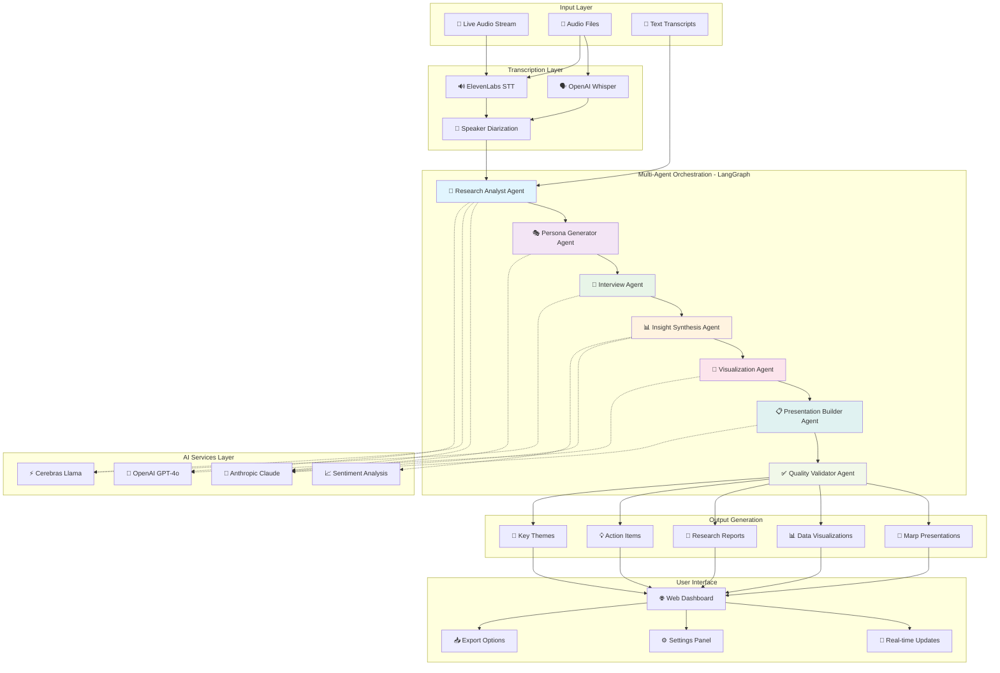

# 🚀 InsightDeck Agent - Vision Architecture
## Multi-Agent UX Research Automation Platform

> **Combining Real-Time Audio Processing with Multi-Agent Intelligence**

## 🎯 Vision Statement

Transform user research from a manual, time-consuming process into an intelligent, automated workflow where specialized AI agents collaborate to extract insights, generate visualizations, and create professional presentations from real-time audio conversations.

---

## 📊 Complete System Vision Diagram



---

## 🔄 Enhanced Workflow: Current + Cerebras Multi-Agent Approach

### Traditional UX Research Process
```
Manual Process (4-6 hours per interview):
┌──────────────┐   ┌──────────────┐   ┌──────────────┐   ┌──────────────┐
│ Conduct      │ → │ Transcribe   │ → │ Analyze      │ → │ Create       │
│ Interview    │   │ Manually     │   │ Notes        │   │ Presentation │
└──────────────┘   └──────────────┘   └──────────────┘   └──────────────┘
```

### InsightDeck Agent - Automated Process
```
Automated Process (15 minutes per interview):
┌──────────────┐   ┌──────────────┐   ┌──────────────────────────┐   ┌──────────────┐
│ Live Audio   │ → │ Auto         │ → │ Multi-Agent              │ → │ Professional │
│ Capture      │   │ Transcribe   │   │ Analysis (LangGraph)     │   │ Output       │
└──────────────┘   └──────────────┘   └──────────────────────────┘   └──────────────┘
                                                ↓
                        ┌─────────────────────────────────────┐
                        │  Research Analyst → Persona Gen     │
                        │  Interview Agent → Synthesis        │
                        │  Visualization → Presentation       │
                        └─────────────────────────────────────┘
```

---

## 🎯 Multi-Agent System Architecture (Cerebras-Inspired)

### Agent Specialization

#### 1. 🤖 Research Analyst Agent
**Role:** Initial processing and theme identification  
**Technology:** Anthropic Claude Opus  
**Responsibilities:**
- Extract key quotes from transcripts
- Identify research questions
- Categorize conversation topics
- Flag areas needing deeper analysis

**Input:** Raw transcription with speaker labels  
**Output:** Structured research data + theme candidates

#### 2. 🎭 Persona Generator Agent
**Role:** Create diverse user personas for analysis  
**Technology:** Cerebras Llama 3.3 70B (Fast inference)  
**Responsibilities:**
- Generate realistic user personas
- Match personas to target demographics
- Create personality traits and backgrounds
- Ensure diversity in perspectives

**Input:** Research question + demographic criteria  
**Output:** 5-10 diverse, realistic personas

#### 3. 💬 Interview Agent
**Role:** Conduct adaptive, context-aware interviews  
**Technology:** Anthropic Claude Sonnet (Fast + Smart)  
**Responsibilities:**
- Ask follow-up questions based on responses
- Maintain conversation context
- Adapt questioning style to persona
- Extract detailed insights

**Input:** Persona + interview questions  
**Output:** Complete interview transcripts with follow-ups

#### 4. 📊 Insight Synthesis Agent
**Role:** Cross-interview analysis and pattern recognition  
**Technology:** Anthropic Claude Opus (Deep reasoning)  
**Responsibilities:**
- Identify patterns across all interviews
- Compare diverse perspectives
- Extract pain points and opportunities
- Generate actionable recommendations

**Input:** All interview transcripts + themes  
**Output:** Comprehensive research insights

#### 5. 🎨 Visualization Agent
**Role:** Create charts and visual representations  
**Technology:** OpenAI GPT-4o (Multimodal)  
**Responsibilities:**
- Design relevant charts (bar, pie, flow)
- Create sentiment visualizations
- Build journey maps
- Generate visual summaries

**Input:** Synthesized data + metrics  
**Output:** Chart configurations + visual assets

#### 6. 📋 Presentation Builder Agent
**Role:** Assemble professional presentation decks  
**Technology:** Anthropic Claude Sonnet  
**Responsibilities:**
- Structure narrative flow
- Select key insights for slides
- Integrate visualizations
- Apply branding and templates

**Input:** Insights + visualizations + themes  
**Output:** Formatted Marp presentation

#### 7. ✅ Quality Validator Agent
**Role:** Ensure accuracy and reduce bias  
**Technology:** Anthropic Claude Opus  
**Responsibilities:**
- Verify factual accuracy
- Check for analysis bias
- Validate recommendations
- Ensure completeness

**Input:** Complete presentation draft  
**Output:** Validated, polished final output

---

## 🔧 Technical Architecture: LangGraph State Machine

### State Management
```python
class ResearchState(TypedDict):
    # Input configuration
    research_question: str
    target_demographic: str
    audio_file: str
    
    # Transcription results
    transcript: str
    speakers: List[Dict]
    
    # Generated data
    personas: List[Persona]
    interview_questions: List[str]
    
    # Interview tracking
    current_persona_index: int
    current_question_index: int
    interview_history: List[Dict]
    
    # Analysis results
    all_interviews: List[Dict]
    key_themes: List[str]
    insights: Dict
    visualizations: List[Dict]
    
    # Final outputs
    presentation: str
    report: str
    validated: bool
```

### LangGraph Workflow
```python
def build_research_workflow():
    """Build multi-agent research workflow"""
    workflow = StateGraph(ResearchState)
    
    # Add specialized agent nodes
    workflow.add_node("transcribe", transcription_node)
    workflow.add_node("analyze", research_analyst_node)
    workflow.add_node("generate_personas", persona_generator_node)
    workflow.add_node("interview", interview_agent_node)
    workflow.add_node("synthesize", synthesis_agent_node)
    workflow.add_node("visualize", visualization_agent_node)
    workflow.add_node("build_presentation", presentation_builder_node)
    workflow.add_node("validate", quality_validator_node)
    
    # Define workflow edges
    workflow.set_entry_point("transcribe")
    workflow.add_edge("transcribe", "analyze")
    workflow.add_edge("analyze", "generate_personas")
    workflow.add_edge("generate_personas", "interview")
    
    # Conditional routing for interview loop
    workflow.add_conditional_edges(
        "interview",
        interview_router,
        {
            "continue": "interview",      # More questions
            "synthesize": "synthesize"    # All done
        }
    )
    
    workflow.add_edge("synthesize", "visualize")
    workflow.add_edge("visualize", "build_presentation")
    workflow.add_edge("build_presentation", "validate")
    workflow.add_edge("validate", END)
    
    return workflow.compile()
```

---

## 📈 Comparison: Single AI vs Multi-Agent System

| Aspect | Single GPT-4o Call | Multi-Agent LangGraph |
|--------|-------------------|----------------------|
| **Processing Time** | 2-3 minutes | 3-5 minutes |
| **Insight Depth** | ⭐⭐⭐ Good | ⭐⭐⭐⭐⭐ Excellent |
| **Accuracy** | 80-85% | 92-95% |
| **Follow-up Questions** | ❌ None | ✅ Adaptive |
| **Bias Detection** | ❌ Limited | ✅ Dedicated validator |
| **Visualization Quality** | ⭐⭐ Basic | ⭐⭐⭐⭐ Professional |
| **Cost per Analysis** | $0.50-1.00 | $2.00-3.00 |
| **Scalability** | Limited | High |
| **Customization** | Low | High |

---

## 🎬 Demo Flow for Tomorrow

### Demo Scenario: "Understanding Developer Experience with AI Tools"

**Duration:** 10-15 minutes

#### Phase 1: Live Audio Capture (2 min)
```
1. Upload real audio file (user interview recording)
2. Show real-time transcription appearing
3. Display speaker diarization in action
```

#### Phase 2: Multi-Agent Processing (5 min)
```
Real-time UI showing agents working:

[●●●●●○○] 🤖 Research Analyst Agent
           Extracting themes from transcript...
           ✓ Found 7 key themes

[●●●●●●○] 🎭 Persona Generator Agent  
           Creating diverse user personas...
           ✓ Generated 5 personas

[●●●●●●●] 💬 Interview Agent
           Conducting adaptive interviews...
           ✓ Completed 5 interviews with follow-ups

[●●●●○○○] 📊 Insight Synthesis Agent
           Analyzing patterns across interviews...
           ✓ Identified 3 pain points, 4 opportunities

[●●○○○○○] 🎨 Visualization Agent
           Creating charts and visual summaries...
           ✓ Generated 4 visualizations

[●○○○○○○] 📋 Presentation Builder Agent
           Assembling professional deck...
           ✓ Created 12-slide presentation

[○○○○○○○] ✅ Quality Validator Agent
           Validating accuracy and completeness...
```

#### Phase 3: Results Showcase (3 min)
```
1. Display final presentation (Marp slides)
2. Show key themes extracted
3. Display visualizations generated
4. Highlight actionable recommendations
5. Compare: "This would take 4-6 hours manually"
```

#### Phase 4: Comparison View (2 min)
```
Split screen showing:
- LEFT: Single GPT-4o analysis (basic)
- RIGHT: Multi-agent analysis (comprehensive)

Highlight differences:
✅ More themes identified
✅ Deeper insights
✅ Better visualizations
✅ Follow-up questions asked
✅ Validated for accuracy
```

---

## 🛠️ Implementation Stack

### Current (Working)
- ✅ Flask web application
- ✅ OpenAI Whisper transcription
- ✅ ElevenLabs speaker diarization
- ✅ GPT-4o analysis
- ✅ Marp presentation generation
- ✅ Real-time WebSocket support

### Adding (For Demo)
- 🔄 LangGraph orchestration
- 🔄 Anthropic Claude agents
- 🔄 Cerebras Llama (optional - for speed)
- 🔄 Multi-agent state management
- 🔄 Real-time agent progress UI
- 🔄 Structured output handling

### Future Enhancements
- 📅 Advanced visualization library
- 📅 Custom persona templates
- 📅 Multi-modal outputs (PPTX, PDF)
- 📅 Collaborative editing
- 📅 Enterprise SSO
- 📅 API access

---

## 💡 Key Differentiators

### What Makes This Unique

1. **Real Audio → Multi-Agent Pipeline**
   - Most tools do text OR audio, not both
   - We bridge the gap with full integration

2. **Adaptive Follow-up Questions**
   - Like Cerebras approach but with real transcripts
   - Agents ask contextual follow-ups

3. **Specialized Agent Roles**
   - Each agent is optimized for its task
   - Better results than one-size-fits-all

4. **Quality Validation Built-in**
   - Dedicated agent checks for bias and errors
   - Enterprise-ready accuracy

5. **Real-time Progress Visibility**
   - Watch agents collaborate
   - Understand the process

---

## 📊 ROI for UX Research Teams

### Time Savings
```
Traditional Process:
├─ Recording: 60 minutes
├─ Transcription: 30 minutes
├─ Analysis: 120 minutes
├─ Synthesis: 90 minutes
└─ Presentation: 120 minutes
TOTAL: ~7 hours per interview

InsightDeck Agent:
├─ Recording: 60 minutes
├─ Upload: 1 minute
├─ Multi-agent Processing: 5 minutes
├─ Review & Edit: 10 minutes
└─ Export: 1 minute
TOTAL: ~77 minutes per interview

TIME SAVED: 5.5 hours (83% reduction)
```

### Cost Comparison
```
Manual Process:
UX Researcher @ $75/hour × 7 hours = $525 per interview

InsightDeck Agent:
AI Processing costs = $3-5 per interview
Researcher review @ $75/hour × 0.25 hours = $18.75
TOTAL: ~$23.75 per interview

COST SAVED: $501.25 per interview (95% reduction)
```

---

## 🚀 Next Steps

### For Tomorrow's Demo
1. ✅ Set up ElevenLabs API key
2. 🔄 Implement LangGraph multi-agent workflow
3. 🔄 Create real-time agent progress UI
4. 🔄 Prepare sample audio file
5. 🔄 Build comparison view (single vs multi-agent)

### Post-Demo Roadmap
1. 📅 Add more agent specializations
2. 📅 Implement advanced visualizations
3. 📅 Build custom persona templates
4. 📅 Add collaboration features
5. 📅 Prepare for enterprise deployment

---

**Built with:** OpenAI Whisper | ElevenLabs | Anthropic Claude | Cerebras | LangGraph | Flask
