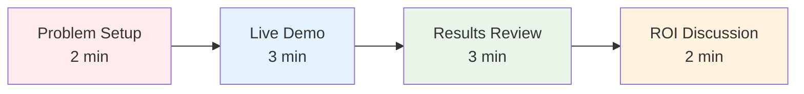
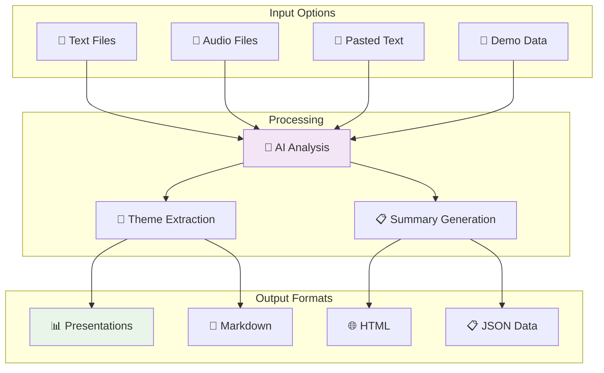
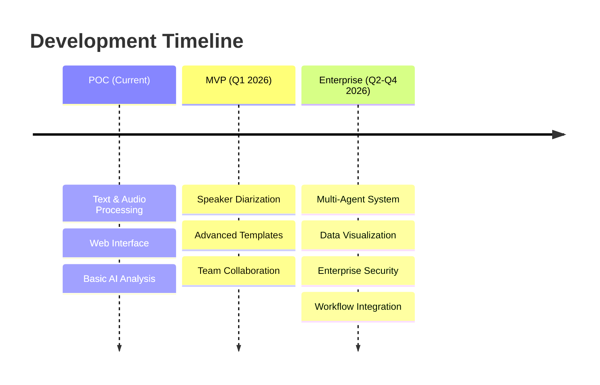
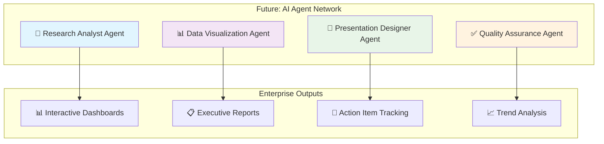
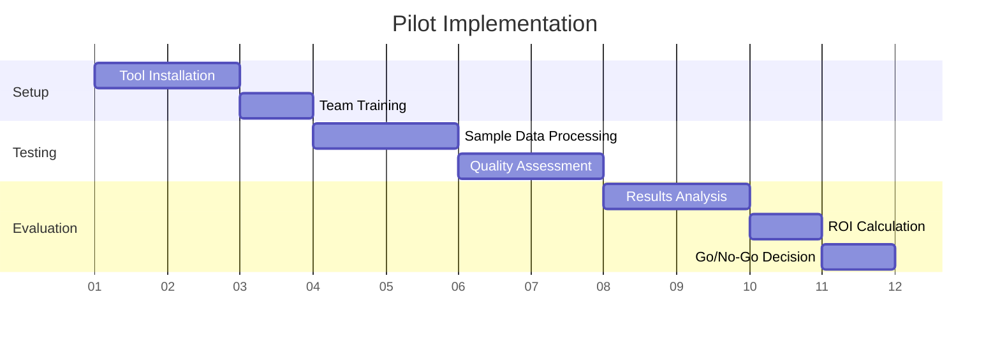
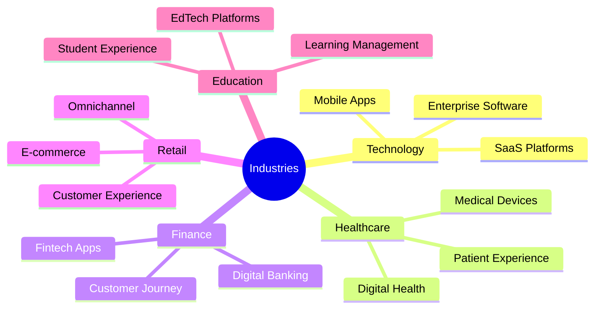
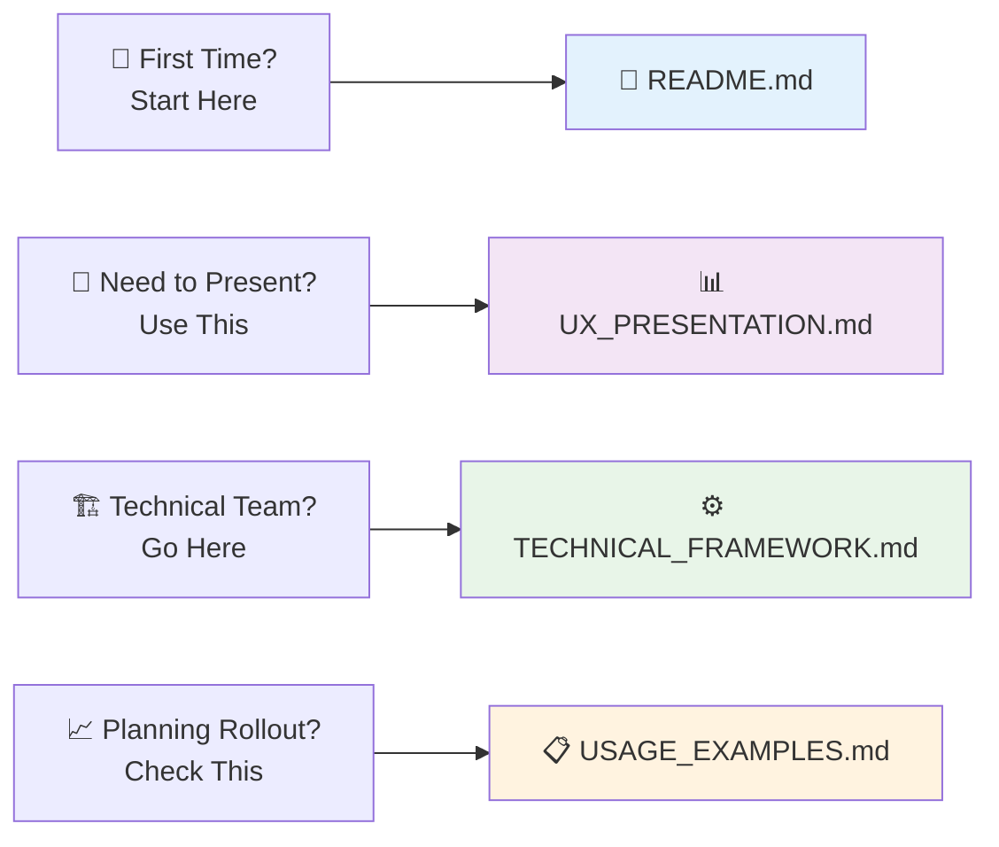

# 📋 InsightDeck Agent: Complete Documentation Index
## Your Comprehensive Guide to AI-Powered Research Automation

**Last Updated:** October 2, 2025  
**Status:** ✅ Production Ready  
**Documentation Structure:** Organized by category

---

## 🎯 **What is InsightDeck Agent?**

InsightDeck Agent is an AI-powered system that **transforms user research transcripts into professional presentation decks in minutes**, reducing manual synthesis time by 85% while maintaining high-quality insights.

### **For UXR Teams: The Bottom Line**

- ⚡ **15 minutes** instead of 4-6 hours per interview analysis
- 🎯 **Consistent** insight quality across all research sessions  
- 📊 **Professional** presentations ready for stakeholders
- 🔄 **Scalable** process for enterprise research teams

---

## � **Documentation Structure**

All documentation is organized in the `docs/` directory:

```
agent-uxr/
├── README.md                        # Start here!
├── DOCUMENTATION_INDEX.md           # This file
├── setup-tunnel.sh                  # Quick deployment script
│
├── docs/
│   ├── deployment/                  # Deployment guides
│   ├── development/                 # Dev logs & status reports
│   ├── product/                     # Product & strategy docs
│   └── guides/                      # Technical guides & examples
```

---

## �📚 **Documentation Library**

### **🚀 Getting Started**

| Document | Location | Purpose | Best For |
|----------|----------|---------|----------|
| **[README.md](./README.md)** | Root | Main overview and quick start | First-time users, setup |
| **[setup-tunnel.sh](./setup-tunnel.sh)** | Root | Automated deployment script | Quick deployment |

### **🌐 Deployment & Operations**

| Document | Location | Purpose | Best For |
|----------|----------|---------|----------|
| **[DEPLOYMENT.md](./docs/deployment/DEPLOYMENT.md)** | docs/deployment/ | Complete deployment guide | DevOps, IT teams |
| **[QUICKSTART_DEPLOY.md](./docs/deployment/QUICKSTART_DEPLOY.md)** | docs/deployment/ | Quick deployment reference | Fast setup |
| **[DEPLOYMENT_COMPLETE.md](./docs/deployment/DEPLOYMENT_COMPLETE.md)** | docs/deployment/ | Deployment summary & demo prep | Presentations |

### **👨‍💻 Development & Status**

| Document | Location | Purpose | Best For |
|----------|----------|---------|----------|
| **[DEVLOG_20251002.md](./docs/development/DEVLOG_20251002.md)** | docs/development/ | Development log (Oct 2, 2025) | Technical history |
| **[STATUS_REPORT_20251002.md](./docs/development/STATUS_REPORT_20251002.md)** | docs/development/ | Executive status report | Stakeholders |
| **[DOCS_UPDATE_SUMMARY.md](./docs/development/DOCS_UPDATE_SUMMARY.md)** | docs/development/ | Documentation update log | Reference |

### **📊 Product & Strategy**

| Document | Location | Purpose | Best For |
|----------|----------|---------|----------|
| **[PRD.md](./docs/product/PRD.md)** | docs/product/ | Product requirements | Product teams |
| **[PRODUCT_ROADMAP.md](./docs/product/PRODUCT_ROADMAP.md)** | docs/product/ | Development timeline | Leadership, planning |
| **[FEATURES.md](./docs/product/FEATURES.md)** | docs/product/ | Feature specifications | Product managers |

### **🏗️ Technical Guides**

| Document | Location | Purpose | Best For |
|----------|----------|---------|----------|
| **[TECHNICAL_FRAMEWORK.md](./docs/guides/TECHNICAL_FRAMEWORK.md)** | docs/guides/ | Architecture & tech stack | Technical teams, IT |
| **[ARCHITECTURE.md](./docs/guides/ARCHITECTURE.md)** | docs/guides/ | System design details | Engineering teams |
| **[TRANSCRIPTION_COMPARISON.md](./docs/guides/TRANSCRIPTION_COMPARISON.md)** | docs/guides/ | Service comparisons | Technical decisions |

### **📖 Usage & Presentations**

| Document | Location | Purpose | Best For |
|----------|----------|---------|----------|
| **[USAGE_EXAMPLES.md](./docs/guides/USAGE_EXAMPLES.md)** | docs/guides/ | Real-world case studies | Implementation planning |
| **[UX_PRESENTATION.md](./docs/guides/UX_PRESENTATION.md)** | docs/guides/ | UXR team presentation deck | Stakeholder presentations |
| **[UX.md](./docs/guides/UX.md)** | docs/guides/ | UX design specifications | Design teams |

---

## 🎪 **Quick Demo Setup**

### **5-Minute Demo for UXR Teams**

```bash
# 1. Clone and setup
git clone https://github.com/stevenvillarino/agent-uxr.git
cd agent-uxr
pip install -r requirements.txt

# 2. Set API key
export OPENAI_API_KEY='your-key-here'

# 3. Start web interface
python web_app.py

# 4. Open browser
open http://localhost:8080

# 5. Try sample data
# Upload files from sample_data/ directory
```

### **Demo Script for Presentations**



1. **Problem (2 min):** Show traditional research synthesis challenges
2. **Demo (3 min):** Upload sample interview, show AI processing
3. **Results (3 min):** Review generated insights and presentation
4. **ROI (2 min):** Discuss time savings and business impact

---

## 📊 **Value Proposition Summary**

### **Research Process Transformation**

```mermaid
comparison
    title Before vs After InsightDeck
    
    before "Manual Process"
    after "AI-Powered Process"
    
    before: 4-6 hours per interview
    after: 15 minutes per interview
    
    before: Inconsistent quality
    after: Standardized insights
    
    before: 3-5 days to stakeholders
    after: Same day delivery
    
    before: Manual theme identification
    after: AI-powered analysis
```

### **Business Impact**

| Metric | Traditional | With InsightDeck | Improvement |
|--------|-------------|------------------|-------------|
| **Processing Time** | 4-6 hours | 15 minutes | 85% reduction |
| **Team Capacity** | 3-4 interviews/week | 20+ interviews/week | 400% increase |
| **Consistency** | Variable | Standardized | Significant improvement |
| **Annual Savings** | Baseline | $50,000+ per researcher | Strong ROI |

---

## 🚀 **Current Capabilities**

### **What Works Today**



### **Live Features Checklist**
- ✅ **Web Interface:** Browser-based, no installation required
- ✅ **Audio Transcription:** Automatic speech-to-text conversion
- ✅ **AI Analysis:** GPT-4o powered insight extraction
- ✅ **Batch Processing:** Multiple files simultaneously
- ✅ **Multiple Formats:** Markdown, HTML, JSON exports
- ✅ **Sample Data:** Ready-to-use demo transcripts

---

## 🗺️ **Future Vision**

### **Enterprise Roadmap**



### **Multi-Agent Vision**



---

## 📈 **Implementation Guide**

### **Phase 1: Pilot Program (Week 1-2)**



#### **Week 1: Setup & Training**
1. **Day 1-2:** Technical setup and installation
2. **Day 3:** Team training session
3. **Day 4-5:** Process sample interviews from `sample_data/`

#### **Week 2: Evaluation**
1. **Day 1-2:** Quality assessment of generated insights
2. **Day 3:** ROI calculation and benefit analysis
3. **Day 4:** Team feedback collection
4. **Day 5:** Go/no-go decision for full rollout

### **Success Criteria**
- ✅ 85%+ time reduction in synthesis
- ✅ 90%+ team satisfaction with insight quality
- ✅ Positive stakeholder feedback on presentations
- ✅ Clear ROI demonstration

---

## 🎯 **Use Case Examples**

### **Perfect For:**

#### **🔄 Regular Research Programs**
- Weekly user interviews
- Monthly usability testing
- Quarterly customer feedback sessions
- Ongoing product research

#### **🚀 Project-Based Research**
- Feature validation studies
- Market research projects
- Competitive analysis
- User journey mapping

#### **📊 Scale Research Initiatives**
- Enterprise-wide research programs
- Cross-functional research collaboration
- Stakeholder-ready research reporting
- Research operations optimization

### **Industry Applications**



---

## 💰 **ROI Calculator**

### **Quick ROI Estimation**

| Your Input | Calculation |
|------------|-------------|
| **Interviews per month** | [ ] × 4.5 hours = [ ] hours saved |
| **Researcher hourly rate** | [ ] × hours saved = [ ] monthly savings |
| **Annual ROI** | Monthly savings × 12 = [ ] annual savings |

### **Example Calculation**
- **Team:** 3 researchers processing 15 interviews/month each
- **Traditional time:** 45 interviews × 4.5 hours = 202.5 hours/month
- **InsightDeck time:** 45 interviews × 0.25 hours = 11.25 hours/month
- **Time saved:** 191.25 hours/month
- **At $150/hour:** 191.25 × $150 = **$28,687/month savings**
- **Annual ROI:** **$344,250**

---

## 🤝 **Getting Support**

### **Documentation Resources**
- 📖 **Setup Guide:** [README.md](./README.md)
- 🎯 **Feature Overview:** [FEATURES.md](./FEATURES.md)
- 🏗️ **Technical Details:** [TECHNICAL_FRAMEWORK.md](./TECHNICAL_FRAMEWORK.md)
- 📊 **Case Studies:** [USAGE_EXAMPLES.md](./USAGE_EXAMPLES.md)

### **Live Support Options**
- 💬 **Technical Help:** Setup and configuration assistance
- 🎓 **Team Training:** Custom onboarding sessions
- 📊 **ROI Analysis:** Efficiency measurement support
- 🚀 **Custom Development:** Enterprise feature requests

### **Contact Information**
- **Project Lead:** Steven Villarino
- **Demo Requests:** Available for team presentations
- **Technical Support:** Comprehensive setup assistance
- **Enterprise Inquiries:** Custom deployment options

---

## 🎉 **Ready to Transform Your Research Workflow?**

### **Next Steps**

1. **🔍 Explore:** Review the documentation suited to your role
2. **🧪 Test:** Set up the tool and process sample data
3. **📊 Evaluate:** Calculate ROI for your specific team
4. **🚀 Implement:** Start with a pilot program
5. **📈 Scale:** Roll out to entire research organization

### **Quick Links**



---

**InsightDeck Agent: Empowering UX Researchers to focus on insights, not formatting.**

*Transform your research workflow today and unlock your team's full potential for strategic analysis and stakeholder impact.*