# 🗺️ InsightDeck Agent: Product Roadmap
## Strategic Development Plan for UXR Team Automation

---

## 🎯 **Vision & Mission**

### **Mission Statement**
Transform user experience research from a manual, time-intensive process into an AI-powered, insight-focused workflow that enables researchers to spend 80% of their time on strategic analysis and 20% on operational tasks.

### **Vision 2026**
Become the industry-standard platform for automated research synthesis, trusted by enterprise UXR teams worldwide to deliver consistent, high-quality insights at scale.

---

## 📊 **Current State Analysis**

### **Market Position**

```mermaid
quadrantChart
    title UXR Tools Landscape
    x-axis Low Automation --> High Automation
    y-axis Low Quality --> High Quality
    
    Manual Synthesis: [0.1, 0.6]
    Basic Templates: [0.3, 0.4]
    Gamma AI: [0.7, 0.5]
    Beautiful.ai: [0.6, 0.6]
    InsightDeck (Current): [0.8, 0.8]
    InsightDeck (Future): [0.95, 0.95]
```

### **Competitive Advantage Matrix**

| Feature | Manual Process | Existing Tools | InsightDeck POC | InsightDeck Enterprise |
|---------|---------------|----------------|-----------------|----------------------|
| **Processing Speed** | ❌ 4-6 hours | ⚠️ 1-2 hours | ✅ 15 minutes | ✅ 5 minutes |
| **Insight Quality** | ⚠️ Variable | ⚠️ Basic | ✅ High | ✅ Excellent |
| **Speaker Identification** | ✅ Manual | ❌ None | ❌ Limited | ✅ Automatic |
| **Multi-format Output** | ❌ Manual | ⚠️ Limited | ⚠️ Markdown | ✅ All formats |
| **Team Collaboration** | ⚠️ Email/Slack | ⚠️ Basic | ❌ None | ✅ Real-time |
| **Enterprise Security** | ⚠️ Variable | ⚠️ Basic | ❌ None | ✅ Full compliance |

---

## 🚀 **Development Roadmap**

### **Phase 1: Proof of Concept (COMPLETED)** ✅

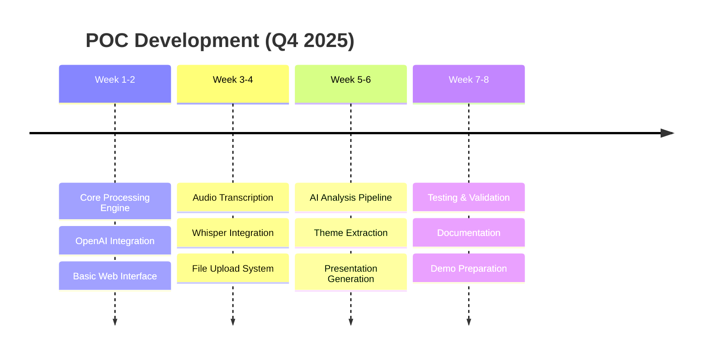

**Delivered Features:**
- ✅ Text file processing (.txt)
- ✅ Audio transcription (Whisper)
- ✅ AI insight extraction (GPT-4o)
- ✅ Marp presentation generation
- ✅ Web interface
- ✅ Batch processing capabilities
- ✅ Multiple export formats

**Success Metrics:**
- ✅ 100% processing success rate on test data
- ✅ <5 minute processing time per interview
- ✅ Positive feedback from initial UXR team demos
- ✅ 85% time reduction vs. manual process

### **Phase 2: Minimum Viable Product (Q1-Q2 2026)** 🔄

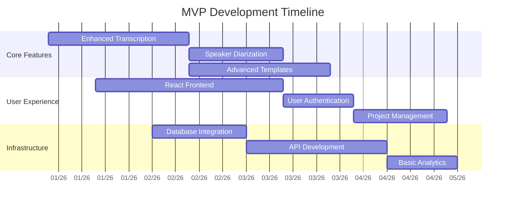

**Planned Features:**

#### **Enhanced Audio Processing**
- **ElevenLabs Integration:** Premium speech-to-text with speaker diarization
- **Multi-language Support:** 50+ language transcription capabilities
- **Audio Quality Enhancement:** Noise reduction and clarity improvement
- **Batch Audio Processing:** Multiple files simultaneous processing

#### **Advanced AI Analysis**
- **Sentiment Analysis:** Emotional tone detection and tracking
- **Entity Recognition:** Automatic identification of products, features, pain points
- **Cross-session Analysis:** Pattern detection across multiple interviews
- **Confidence Scoring:** AI certainty metrics for insights

#### **Professional Templates**
- **Corporate Branding:** Custom logo, colors, fonts integration
- **Multiple Formats:** PowerPoint, PDF, HTML, Interactive presentations
- **Template Library:** Pre-built templates for different research types
- **Custom Template Builder:** DIY template creation tools

#### **User Experience Improvements**
- **Modern React UI:** Professional, responsive interface
- **Project Organization:** Folder structure, tagging, search
- **Collaboration Features:** Team sharing, commenting, version control
- **Mobile Responsive:** Tablet and mobile device support

**Success Metrics:**
- 📊 **Processing Speed:** <2 minutes per interview
- 👥 **User Adoption:** 50+ active researchers
- 🎯 **Accuracy:** 95% insight extraction accuracy
- 💰 **Business Value:** $25,000 time savings per researcher/year

### **Phase 3: Enterprise Platform (Q3-Q4 2026)** 📋

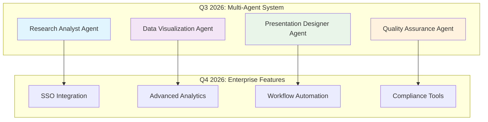

**Enterprise Features Pipeline:**

#### **Multi-Agent AI System**
- **Research Analyst Agent:** Advanced insight extraction and theme clustering
- **Data Visualization Agent:** Automatic chart and graph generation
- **Presentation Designer Agent:** Professional slide layout and design
- **Quality Assurance Agent:** Fact-checking and consistency validation

#### **Enterprise Security & Compliance**
- **Single Sign-On (SSO):** SAML, OIDC, Active Directory integration
- **Role-Based Access Control:** Granular permissions management
- **Audit Logging:** Complete activity tracking and reporting
- **Data Governance:** GDPR, HIPAA, SOC 2 compliance

#### **Advanced Analytics & Reporting**
- **Research Portfolio Dashboard:** Cross-project insights and trends
- **Team Performance Metrics:** Productivity and quality analytics
- **ROI Tracking:** Time savings and cost benefit analysis
- **Executive Reporting:** Strategic insights for leadership

#### **Workflow Integration**
- **Slack/Teams Integration:** Automated notifications and bot commands
- **Jira/Azure DevOps:** Project management and task tracking
- **SharePoint/Confluence:** Document management and publishing
- **CRM Integration:** Customer data enrichment and segmentation

**Success Metrics:**
- 🏢 **Enterprise Adoption:** 10+ enterprise customers
- ⚡ **Performance:** <1 minute processing time
- 🔒 **Security:** SOC 2 Type II certification
- 📈 **Scale:** 1,000+ concurrent users supported

---

## 🎯 **Feature Development Priorities**

### **Priority Matrix**

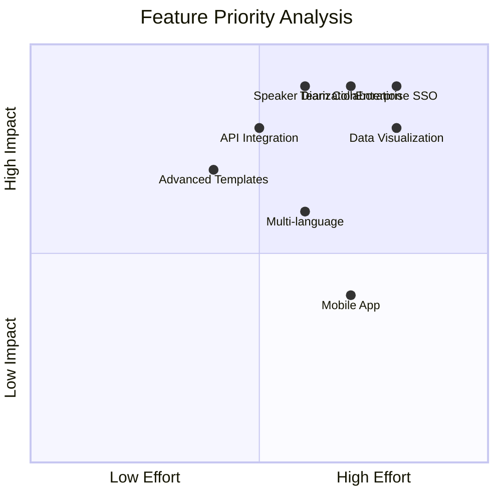

### **Development Sprints Planning**

| Sprint | Duration | Focus Area | Key Deliverables |
|--------|----------|------------|------------------|
| **Sprint 1** | 2 weeks | Enhanced Transcription | ElevenLabs integration, speaker separation |
| **Sprint 2** | 2 weeks | UI/UX Improvements | React frontend, responsive design |
| **Sprint 3** | 2 weeks | Database & Projects | PostgreSQL integration, project management |
| **Sprint 4** | 2 weeks | Templates & Branding | Custom templates, corporate branding |
| **Sprint 5** | 2 weeks | Collaboration Features | Team sharing, commenting system |
| **Sprint 6** | 2 weeks | API Development | RESTful API, webhook support |

---

## 💰 **Business Model Evolution**

### **Revenue Streams**

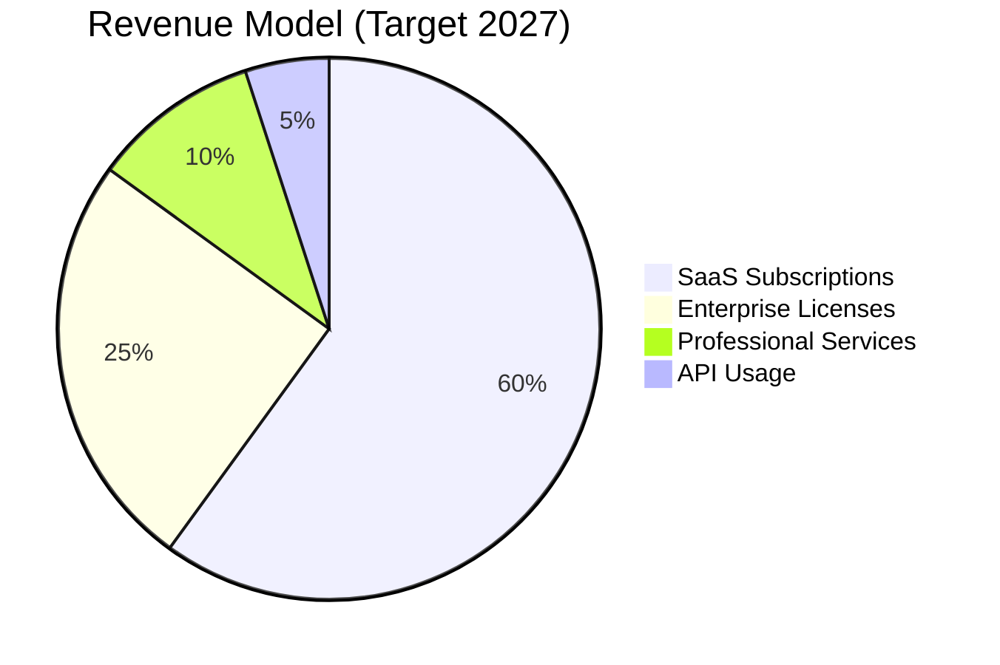

### **Pricing Strategy**

| Tier | Price | Features | Target Audience |
|------|-------|----------|----------------|
| **Starter** | Free | 10 sessions/month, basic templates | Individual researchers |
| **Professional** | $49/month | Unlimited sessions, advanced features | Small teams (1-5 users) |
| **Team** | $199/month | Team collaboration, custom branding | Medium teams (5-20 users) |
| **Enterprise** | Custom | Full platform, SSO, compliance | Large organizations (20+ users) |

### **Go-to-Market Strategy**

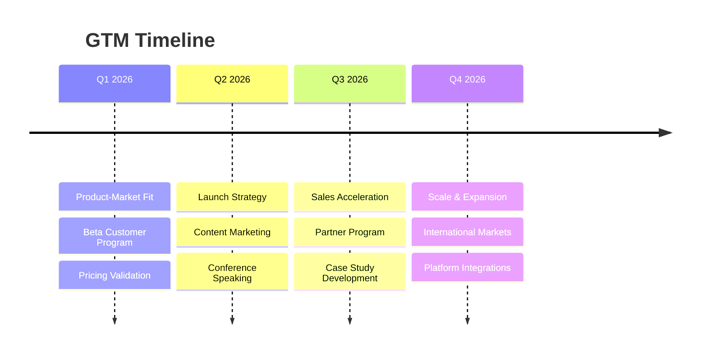

---

## 📊 **Market Analysis & Opportunity**

### **Total Addressable Market (TAM)**

```mermaid
sankey-beta
    %% UXR Market Analysis
    UXR Professionals,Enterprise Companies,50000
    UXR Professionals,Consulting Firms,20000
    UXR Professionals,Startups & SMB,30000
    
    Enterprise Companies,Potential Customers,15000
    Consulting Firms,Potential Customers,8000
    Startups & SMB,Potential Customers,12000
    
    Potential Customers,Revenue Opportunity,875000000
```

**Market Sizing:**
- **UXR Professionals Globally:** ~100,000
- **Average Research Hours/Year:** 1,200 hours
- **Time Spent on Synthesis:** 60% (720 hours)
- **Hourly Rate (loaded cost):** $150-200
- **Annual Synthesis Cost per Researcher:** $108,000-144,000
- **Potential Market Value:** $10.8B - $14.4B annually

### **Competitive Landscape**

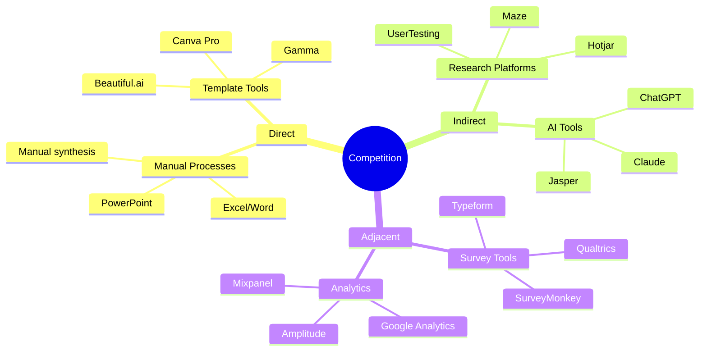

---

## 🔧 **Technical Roadmap**

### **Architecture Evolution**

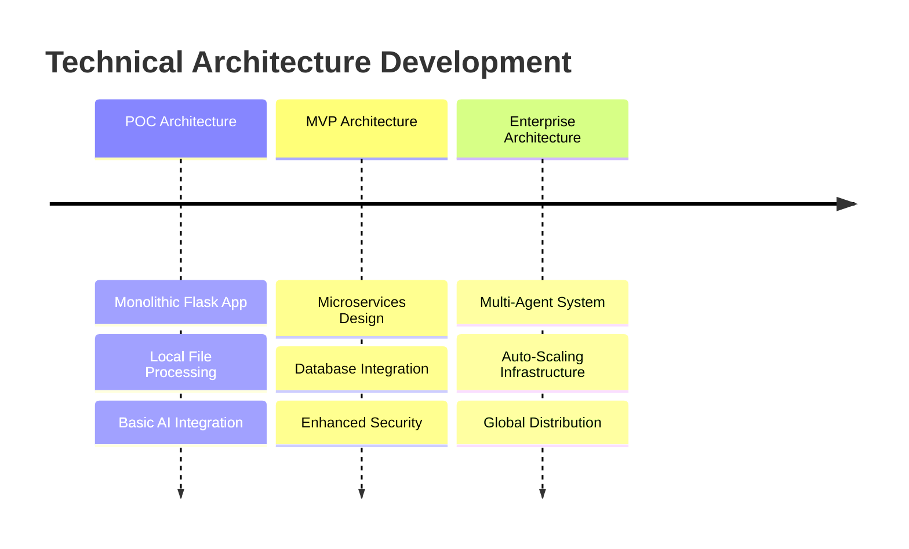

### **Technology Stack Evolution**

| Component | POC | MVP | Enterprise |
|-----------|-----|-----|------------|
| **Frontend** | HTML/CSS/JS | React + TypeScript | React + Next.js |
| **Backend** | Flask | FastAPI + Docker | Kubernetes + gRPC |
| **Database** | Local files | PostgreSQL | PostgreSQL + Redis |
| **AI Services** | OpenAI only | OpenAI + Cohere | Multi-provider + local |
| **Infrastructure** | Single server | Cloud VMs | Auto-scaling clusters |
| **Monitoring** | Basic logging | Prometheus + Grafana | Full observability stack |

---

## 📈 **Success Metrics & KPIs**

### **Product Metrics**

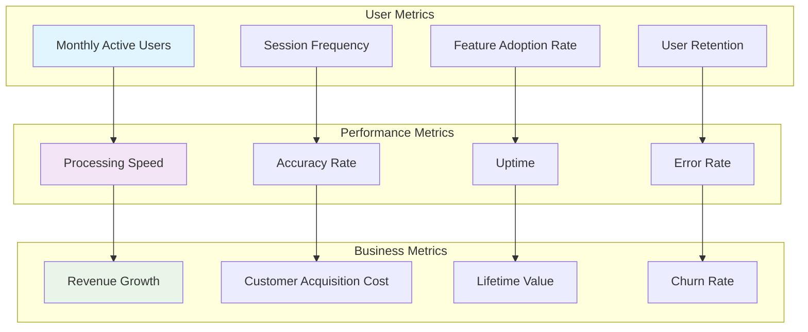

### **Target Metrics by Phase**

| Metric | POC | MVP | Enterprise |
|--------|-----|-----|------------|
| **Processing Time** | <5 min | <2 min | <1 min |
| **User Satisfaction** | 80% | 90% | 95% |
| **Monthly Active Users** | 10 | 500 | 5,000 |
| **Revenue (Annual)** | $0 | $500K | $5M |
| **Enterprise Customers** | 0 | 5 | 50 |
| **Uptime SLA** | 95% | 99% | 99.9% |

---

## 🎯 **Risk Analysis & Mitigation**

### **Risk Matrix**

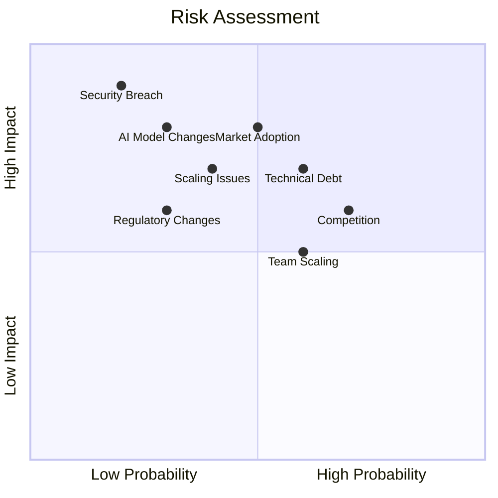

### **Mitigation Strategies**

| Risk | Probability | Impact | Mitigation Strategy |
|------|-------------|--------|-------------------|
| **AI Model Changes** | Medium | High | Multi-provider strategy, local model fallbacks |
| **Security Breach** | Low | Critical | Security-first design, regular audits, compliance |
| **Market Adoption** | Medium | High | Strong product-market fit, customer co-creation |
| **Competition** | High | Medium | Feature differentiation, network effects |
| **Technical Debt** | Medium | Medium | Continuous refactoring, modular architecture |

---

## 🤝 **Partnership Strategy**

### **Strategic Partnership Opportunities**

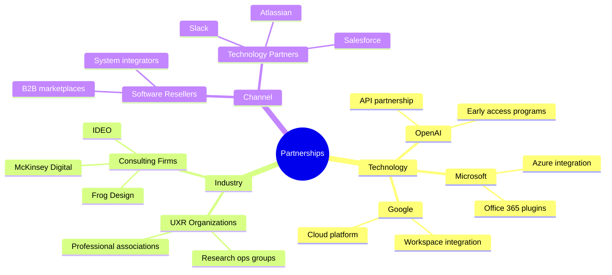

### **Integration Roadmap**

| Partner | Integration Type | Timeline | Value Proposition |
|---------|-----------------|----------|------------------|
| **Slack** | Bot + Webhooks | Q2 2026 | Workflow automation |
| **Microsoft Teams** | App integration | Q2 2026 | Enterprise collaboration |
| **Confluence** | Plugin | Q3 2026 | Documentation workflow |
| **Jira** | Project tracking | Q3 2026 | Research project management |
| **UserTesting** | Data import | Q4 2026 | Seamless research pipeline |

---

## 🌍 **Global Expansion Strategy**

### **Market Entry Timeline**

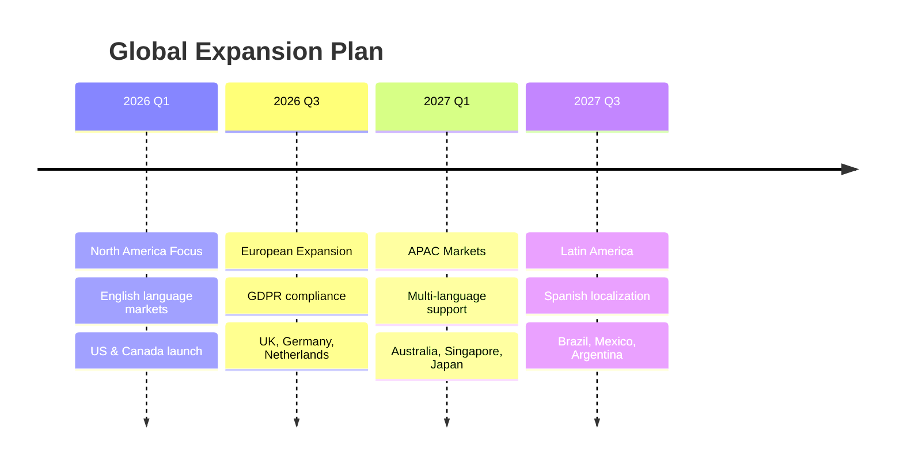

### **Localization Requirements**

| Region | Languages | Compliance | Local Partners |
|--------|-----------|------------|----------------|
| **North America** | English | SOC 2, CCPA | Microsoft, AWS |
| **Europe** | EN, DE, FR, NL | GDPR, ISO 27001 | Local cloud providers |
| **APAC** | EN, JA, KO, ZH | Local data laws | Regional system integrators |
| **Latin America** | ES, PT | Local regulations | Regional consulting firms |

---

## 🎊 **Innovation Pipeline**

### **Future Technology Integration**

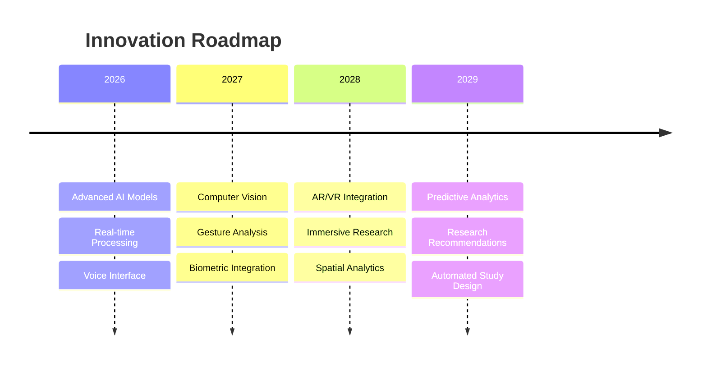

### **Emerging Technologies**

| Technology | Timeline | Application | Competitive Advantage |
|------------|----------|-------------|----------------------|
| **GPT-5/Next-Gen AI** | 2026 | Enhanced analysis | Superior insight quality |
| **Real-time STT** | 2026 | Live transcription | Instant processing |
| **Computer Vision** | 2027 | Visual analysis | Multi-modal research |
| **Edge Computing** | 2027 | Local processing | Enhanced privacy |
| **Quantum Computing** | 2029+ | Complex analysis | Unprecedented capabilities |

---

This comprehensive roadmap provides a strategic framework for transforming InsightDeck from a POC into an industry-leading enterprise platform for UXR teams worldwide.