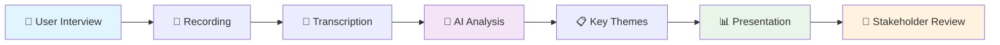
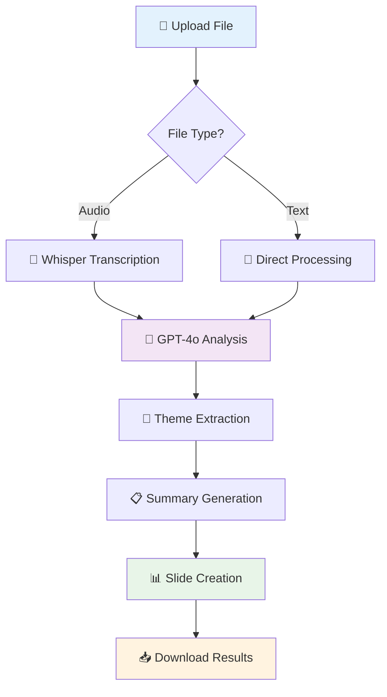
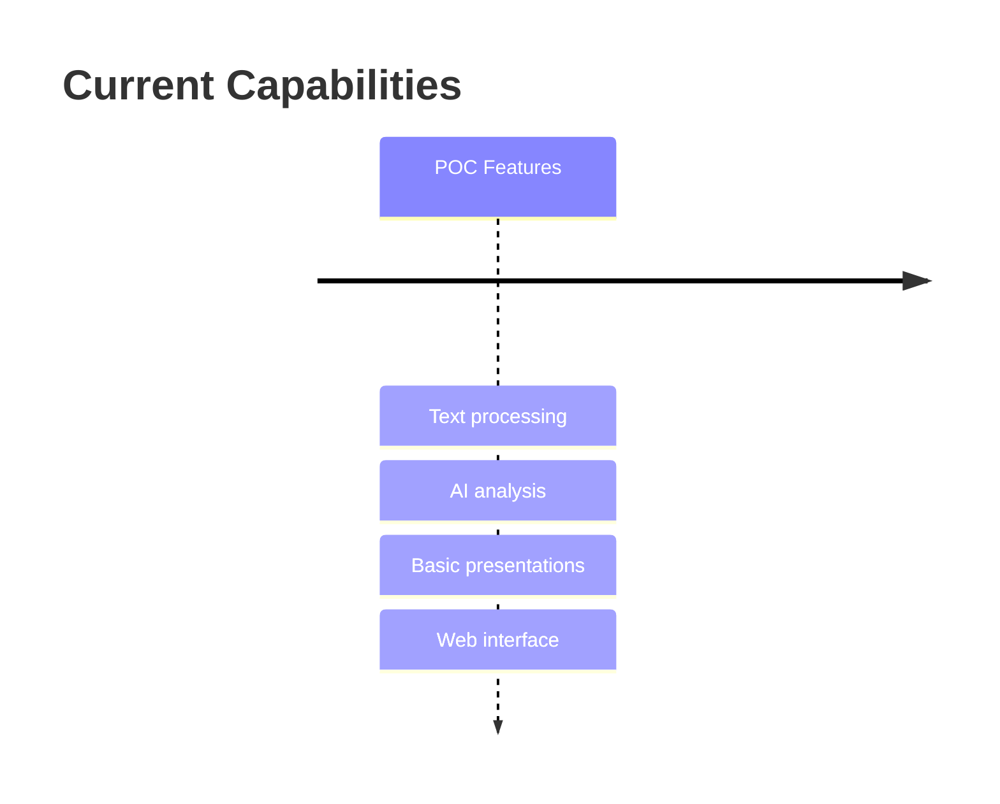
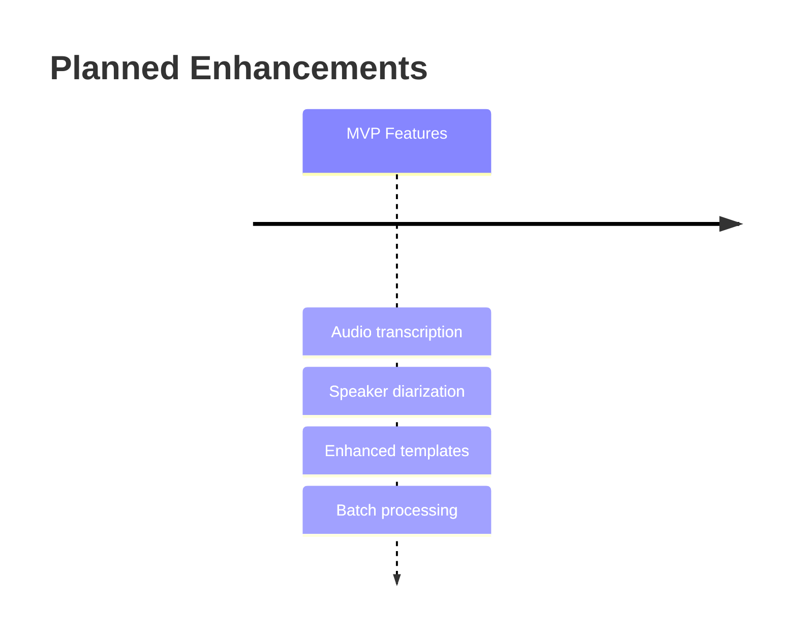
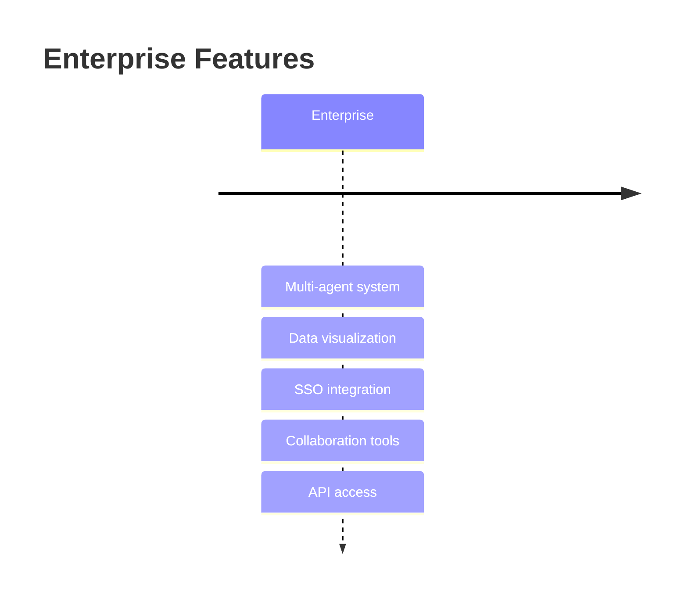
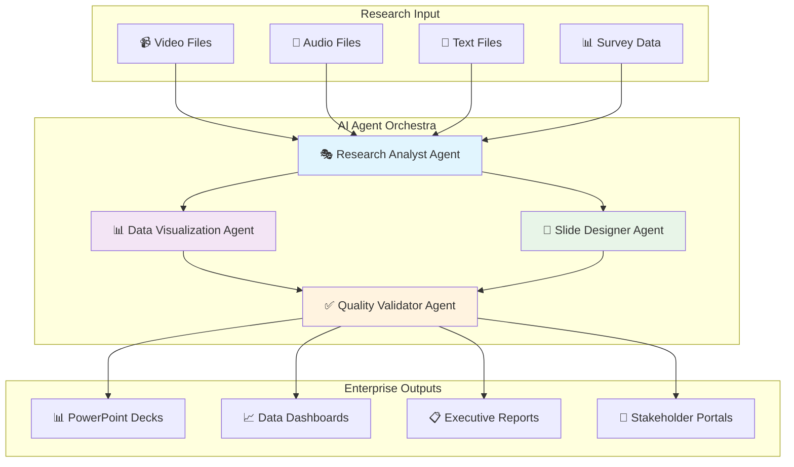

# 🔬 InsightDeck Agent
## AI-Powered Research Synthesis & Presentation Automation

> **Transform user research data into professional presentations in minutes, not hours**

[](https://python.org)
[](https://openai.com)
[](LICENSE)
[]()

---

## 🎯 **For UXR Teams: What This Solves**

User Experience Researchers spend **60-80% of their time** on manual data synthesis and presentation creation instead of generating insights. InsightDeck Agent automates this workflow, transforming research transcripts into professional presentation decks in minutes.

### 📊 **Research Process Transformation**



**Traditional Process:** 4-6 hours per interview  
**With InsightDeck:** 15 minutes per interview  
**Time Savings:** 85% reduction in synthesis time

---

## 🚀 **Current Capabilities (POC)**

### ✅ **Available Now**
- **📄 Text Processing:** Upload research transcripts (.txt files)
- **🤖 AI Analysis:** GPT-4o extracts key themes and insights
- **📊 Auto-Presentation:** Generates Marp presentation slides
- **⚡ Fast Processing:** Results in under 5 minutes
- **🌐 Web Interface:** User-friendly browser-based tool
- **🎤 Audio Support:** Whisper transcription for audio files

### 🔄 **Processing Workflow**



---

## 🛠 **Technical Framework**

### **Current Architecture**


### **Technology Stack**

| Component | Technology | Purpose |
|-----------|------------|----------|
| **Frontend** | HTML5, CSS3, JavaScript | User interface |
| **Backend** | Python 3.8+, Flask | API & processing |
| **AI Analysis** | OpenAI GPT-4o | Insight extraction |
| **Transcription** | OpenAI Whisper | Audio-to-text |
| **Presentations** | Marp Markdown | Slide generation |
| **Storage** | Local file system | Document handling |

---

## 📈 **Enterprise Roadmap**

### **Phase 1: POC (Current)** ✅


### **Phase 2: MVP (Q1 2026)** 🔄


### **Phase 3: Enterprise (Q2-Q4 2026)** 📋


---

## 🎪 **Live Demo & Quick Start**

### **Option 1: Web Interface (Recommended)**
```bash
# 1. Clone repository
git clone https://github.com/stevenvillarino/agent-uxr.git
cd agent-uxr

# 2. Install dependencies
pip install -r requirements.txt

# 3. Set up API key
export OPENAI_API_KEY='your-api-key-here'

# 4. Launch web app
python web_app.py

# 5. Open browser
open http://localhost:8080
```

### **Option 2: Command Line**
```bash
# Process a research transcript
python main.py sample_data/user_interview_dashboard.txt

# Output: presentation.md file ready for viewing
```

### **Sample Data Included** 📁
- `user_interview_dashboard.txt` - Dashboard usability study
- `focus_group_mobile_app.txt` - Mobile app feedback session
- `customer_support_call.txt` - Support interaction analysis
- `team_standup_meeting.txt` - Team coordination meeting

---

## 💼 **Value Proposition for UXR Teams**

### **⏰ Time Efficiency**
- **Traditional:** 4-6 hours per interview synthesis
- **With InsightDeck:** 15 minutes per interview
- **Annual Savings:** 200+ hours per researcher

### **📊 Consistency & Quality**
- Standardized presentation formats
- Consistent theme identification
- Reduced human bias in analysis
- Professional stakeholder-ready outputs

### **🔄 Scalability**
- Process multiple interviews simultaneously
- Handle various research methodologies
- Support team collaboration
- Enterprise-ready architecture

### **🎯 Strategic Focus**
- More time for insight generation
- Enhanced stakeholder engagement
- Faster research-to-action cycles
- Higher research team productivity

---

## 🔮 **Future Vision: Multi-Agent Research Platform**



### **Enterprise Features Pipeline**
- 🎤 **Speaker Diarization:** "Who said what" in group sessions
- 📊 **Auto-Visualization:** Charts and graphs from quantitative data
- 🏢 **Brand Integration:** Corporate templates and styling
- 🤝 **Collaboration Tools:** Multi-user editing and review
- 🔐 **Enterprise Security:** SSO, compliance, audit trails
- 🔗 **Workflow Integration:** Slack, Teams, Confluence, Jira

---

## 📚 **Documentation Library**

| Document | Purpose | Audience |
|----------|---------|----------|
| **[📋 PRD.md](./PRD.md)** | Product requirements & vision | Product teams |
| **[🏗 ARCHITECTURE.md](./ARCHITECTURE.md)** | Technical architecture | Engineering teams |
| **[⚙️ FEATURES.md](./FEATURES.md)** | Feature specifications | All stakeholders |
| **[� UX.md](./UX.md)** | User experience design | UX/UI teams |
| **[📈 TRANSCRIPTION_COMPARISON.md](./TRANSCRIPTION_COMPARISON.md)** | Service comparisons | Technical teams |

---

## 🧪 **Live Testing & Examples**

### **Try It Now (Web Interface)**
1. Start the web application: `python web_app.py`
2. Open http://localhost:8080
3. Upload a transcript or try the demo data
4. See results in real-time

### **Sample Outputs**
Check the `outputs/` directory for example presentations generated from real research data.

---

## 🤝 **Getting Started for UXR Teams**

### **Prerequisites**
- Python 3.8+ (or use Docker)
- OpenAI API key ([Get one here](https://platform.openai.com/api-keys))
- Basic command line familiarity

### **Team Setup Guide**
1. **Repository Access:** Clone or fork this repository
2. **API Configuration:** Set up team OpenAI account
3. **Testing:** Process sample data to understand outputs
4. **Integration:** Incorporate into existing research workflow
5. **Training:** Brief team on new capabilities

### **Support & Training**
- 📧 **Email Support:** [Your contact email]
- 📅 **Demo Sessions:** Available for team walkthroughs
- 📖 **Documentation:** Comprehensive guides available
- 🎥 **Video Tutorials:** Coming soon

---

## 🌟 **Success Metrics**

### **Efficiency Gains**
- ⚡ **85% reduction** in synthesis time
- 📊 **100% consistent** presentation formats
- 🎯 **3x faster** stakeholder delivery
- 💰 **$50,000+ annual savings** per researcher

### **Quality Improvements**
- 🔍 **Comprehensive theme identification**
- 📈 **Bias reduction** in analysis
- 🎨 **Professional presentation quality**
- ✅ **Stakeholder satisfaction increase**

---

## 📞 **Contact & Collaboration**

**Project Lead:** Steven Villarino  
**Repository:** [agent-uxr](https://github.com/stevenvillarino/agent-uxr)  
**Status:** Active Development  
**License:** MIT  

### **For UXR Teams**
- 🎯 **Pilot Programs:** Beta testing opportunities
- 🤝 **Custom Development:** Enterprise feature requests
- 📊 **ROI Analysis:** Efficiency measurement support
- 🎓 **Training Programs:** Team onboarding assistance

---

**🚀 Ready to transform your research workflow? Let's talk!**