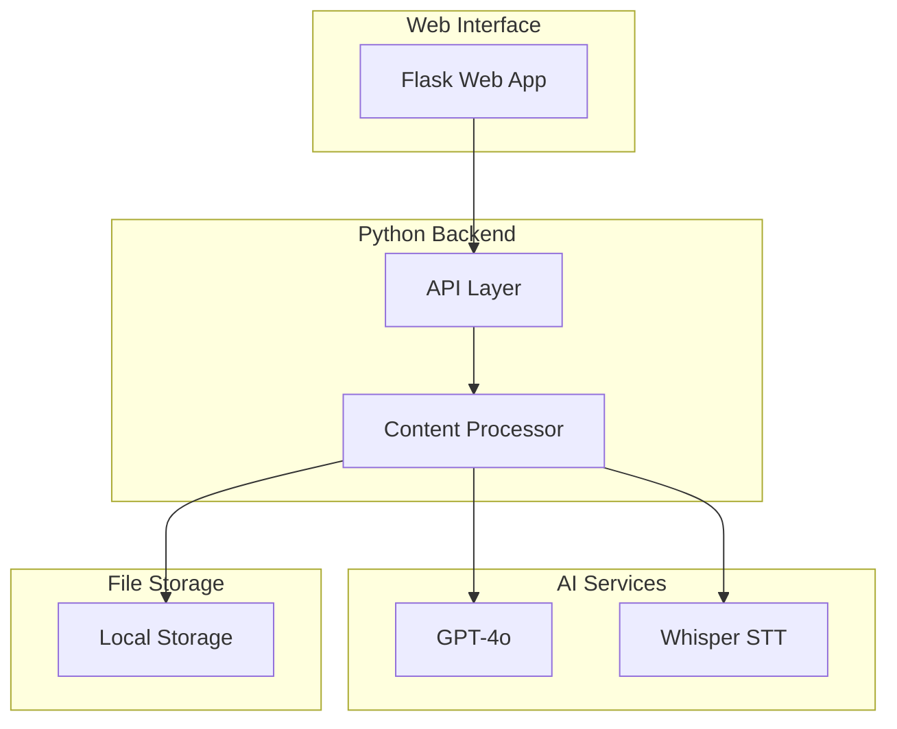

# 🔬 UXR Synthesizer
## AI-Powered Research Synthesis & Presentation Automation

> **Transform user research data into professional presentations in minutes, not hours.**

[](https://python.org)
[](https://openai.com)
[](DOCKER_SETUP.md)
[](LICENSE)
[]()

**🎉 Latest Update (October 6, 2025):** Dockerized for zero-dependency setup and fixed critical bugs.

---

## 🚀 Getting Started (Recommended)

This project is designed to run in Docker to provide a consistent, dependency-free experience. This is the fastest and easiest way to get started.

**Prerequisites:**
- [Docker](https://docs.docker.com/get-docker/) installed.
- An [OpenAI API Key](https://platform.openai.com/api-keys).

### **3-Step Docker Setup**

1.  **Clone the repository:**
    ```bash
    git clone https://github.com/stevenvillarino/agent-uxr.git
    cd agent-uxr
    ```

2.  **Set your API key:**
    ```bash
    echo "OPENAI_API_KEY=your_openai_api_key_here" > .env
    ```

3.  **Run with Docker Compose:**
    ```bash
    docker compose up
    ```

That's it! The application will be available at **http://localhost:8080**.

---

## 🎯 **For UXR Teams: What This Solves**

User Experience Researchers spend **60-80% of their time** on manual data synthesis and presentation creation instead of generating insights. UXR Synthesizer automates this workflow, transforming research transcripts into professional presentation decks in minutes.

### 🎧 **Advanced Audio Processing**
- **Dual Transcription Engines:** Choose between OpenAI Whisper or ElevenLabs Speech-to-Text
- **Speaker Diarization:** Automatic "who said what" identification with ElevenLabs
- **Real-time Processing:** Live audio session support with WebSocket integration

### 📊 **Research Process Transformation**

```mermaid
flowchart LR
    A[👥 User Interview] --> B[🎥 Recording]
    B --> C[📝 Transcription]
    C --> D[🧠 AI Analysis]
    D --> E[📋 Key Themes]
    E --> F[📊 Presentation]
    F --> G[🎯 Stakeholder Review]
    
    style A fill:#e1f5fe
    style D fill:#f3e5f5
    style F fill:#e8f5e8
    style G fill:#fff3e0
```



**Traditional Process:** 4-6 hours per interview  
**With UXR Synthesizer:** 15 minutes per interview
**Time Savings:** 85% reduction in synthesis time

---

## 🚀 **Current Capabilities (POC)**

### ✅ **Available Now**

- **📄 Text Processing:** Upload research transcripts (.txt files)
- **🎵 Audio Transcription:** Dual engine support - OpenAI Whisper + ElevenLabs Speech-to-Text
- **👥 Speaker Diarization:** Automatic speaker identification and separation (ElevenLabs)
- **🤖 AI Analysis:** GPT-4o extracts key themes and insights
- **📊 Auto-Presentation:** Generates Marp presentation slides
- **⚡ Fast Processing:** Results in under 5 minutes
- **🌐 Web Interface:** User-friendly browser-based tool with service selection
- **⚙️ API Configuration:** Built-in settings panel for OpenAI and ElevenLabs keys
- **🎧 Live Sessions:** Real-time audio processing with WebSocket support

### 🔄 **Processing Workflow**

```mermaid
flowchart TD
    A[📁 Upload File] --> B{File Type?}
    B -->|Audio| C[🎵 Whisper Transcription]
    B -->|Text| D[📝 Direct Processing]
    C --> E[🧠 GPT-4o Analysis]
    D --> E
    E --> F[🎯 Theme Extraction]
    F --> G[📋 Summary Generation]
    G --> H[📊 Slide Creation]
    H --> I[📥 Download Results]
    
    style A fill:#e3f2fd
    style E fill:#f3e5f5
    style H fill:#e8f5e8
    style I fill:#fff3e0
```



---

## 🛠 **Technical Framework**

### **Current Architecture**



### **Technology Stack**

| Component | Technology | Purpose |
|-----------|------------|----------|
| **Frontend** | HTML5, CSS3, JavaScript | User interface |
| **Backend** | Python 3.8+, Flask | API & processing |
| **AI Analysis** | OpenAI GPT-4o | Insight extraction |
| **Transcription** | OpenAI Whisper + ElevenLabs STT | Audio-to-text conversion |
| **Speaker ID** | ElevenLabs API | Speaker diarization |
| **Real-time** | WebSockets, Flask-SocketIO | Live audio sessions |
| **Presentations** | Marp Markdown | Slide generation |
| **Storage** | Local file system | Document handling |

---

## 📈 **Enterprise Roadmap**

### **Phase 1: POC (Current)** ✅


### **Phase 2: MVP (Q1 2026)** 🔄


### **Phase 3: Enterprise (Q2-Q4 2026)** 📋


---

## 🎪 **Live Demo & Quick Start**

### **Option 1: Docker (Zero Install) 🐳** 
```bash
# 1. Clone repository
git clone https://github.com/stevenvillarino/agent-uxr.git
cd agent-uxr

# 2. Set API key and run
echo "OPENAI_API_KEY=your_roku_openai_api_key_here" > .env
docker compose up

# 3. Open browser
open http://localhost:8080
```
**Perfect for:** Demos, client presentations, quick testing  
**Requirements:** Just Docker - no Python installation needed!  
**Note:** Use your Roku organization's OpenAI API key for access

### **Option 2: Local Python Setup**
```bash
# 1. Clone repository
git clone https://github.com/stevenvillarino/agent-uxr.git
cd agent-uxr

# 2. Install dependencies
pip install -r requirements.txt

# 3. Set up API keys
export OPENAI_API_KEY='your-roku-openai-api-key-here'
export ELEVENLABS_API_KEY='your-elevenlabs-api-key-here'  # Optional for speaker diarization

# 4. Launch web app
python web_app.py

# 5. Open browser
open http://localhost:8080
```

**🔧 API Key Setup:**
- **OpenAI:** Required for AI analysis ([Get Roku OpenAI API Key](https://platform.openai.com/api-keys))
- **ElevenLabs:** Optional for speaker diarization ([Get API Key](https://elevenlabs.io/))
- **Web Settings:** Configure keys through the web interface settings panel

### **Option 3: Command Line**
```bash
# Process a research transcript
python main.py sample_data/user_interview_dashboard.txt

# Output: presentation.md file ready for viewing
```

### **Sample Data Included** 📁
- `user_interview_dashboard.txt` - Dashboard usability study
- `focus_group_mobile_app.txt` - Mobile app feedback session
- `customer_support_call.txt` - Support interaction analysis
- `team_standup_meeting.txt` - Team coordination meeting

---

## 💼 **Value Proposition for UXR Teams**

### **⏰ Time Efficiency**
- **Traditional:** 4-6 hours per interview synthesis
- **With UXR Synthesizer:** 15 minutes per interview
- **Annual Savings:** 200+ hours per researcher

### **📊 Consistency & Quality**
- Standardized presentation formats
- Consistent theme identification
- Reduced human bias in analysis
- Professional stakeholder-ready outputs

### **🔄 Scalability**
- Process multiple interviews simultaneously
- Handle various research methodologies
- Support team collaboration
- Enterprise-ready architecture

### **🎯 Strategic Focus**
- More time for insight generation
- Enhanced stakeholder engagement
- Faster research-to-action cycles
- Higher research team productivity

---

## 🔮 **Future Vision: Multi-Agent Research Platform**

```mermaid
flowchart TB
    subgraph "Research Input"
        A[📹 Video Files]
        B[🎵 Audio Files]
        C[📝 Text Files]
        D[📊 Survey Data]
    end
    
    subgraph "AI Agent Orchestra"
        E[🎭 Research Analyst Agent]
        F[📊 Data Visualization Agent]
        G[🎨 Slide Designer Agent]
        H[✅ Quality Validator Agent]
    end
    
    subgraph "Enterprise Outputs"
        I[📊 PowerPoint Decks]
        J[📈 Data Dashboards]
        K[📋 Executive Reports]
        L[🔗 Stakeholder Portals]
    end
    
    A --> E
    B --> E
    C --> E
    D --> E
    
    E --> F
    E --> G
    F --> H
    G --> H
    
    H --> I
    H --> J
    H --> K
    H --> L
    
    style E fill:#e1f5fe
    style F fill:#f3e5f5
    style G fill:#e8f5e8
    style H fill:#fff3e0
```



### **Enterprise Features Pipeline**
- ✅ **Speaker Diarization:** "Who said what" in group sessions (Available with ElevenLabs)
- 📊 **Auto-Visualization:** Charts and graphs from quantitative data
- 🏢 **Brand Integration:** Corporate templates and styling
- 🤝 **Collaboration Tools:** Multi-user editing and review
- 🔐 **Enterprise Security:** SSO, compliance, audit trails
- 🔗 **Workflow Integration:** Slack, Teams, Confluence, Jira

---

## 📚 **Documentation Library**

| Document | Purpose | Audience |
|----------|---------|----------|
| **[📋 PRD.md](./docs/product/PRD.md)** | Product requirements & vision | Product teams |
| **[🏗 ARCHITECTURE.md](./docs/guides/ARCHITECTURE.md)** | Technical architecture | Engineering teams |
| **[⚙️ FEATURES.md](./docs/product/FEATURES.md)** | Feature specifications | All stakeholders |
| **[👩‍💻 UX.md](./docs/guides/UX.md)** | User experience design | UX/UI teams |
| **[📈 TRANSCRIPTION_COMPARISON.md](./docs/guides/TRANSCRIPTION_COMPARISON.md)** | Service comparisons | Technical teams |

---

## 🧪 **Live Testing & Examples**

### **Try It Now (Web Interface)**
1. Start the web application: `python web_app.py`
2. Open http://localhost:8080
3. Upload a transcript or try the demo data
4. See results in real-time

### **Sample Outputs**
Check the `outputs/` directory for example presentations generated from real research data.

---

## 🤝 **Getting Started for UXR Teams**

### **Prerequisites**
- Python 3.8+ (or use Docker)
- OpenAI API key ([Get one here](https://platform.openai.com/api-keys))
- Basic command line familiarity

### **Team Setup Guide**
1. **Repository Access:** Clone or fork this repository
2. **API Configuration:** Set up team OpenAI account
3. **Testing:** Process sample data to understand outputs
4. **Integration:** Incorporate into existing research workflow
5. **Training:** Brief team on new capabilities

### **Support & Training**
- 📧 **Email Support:** [Your contact email]
- 📅 **Demo Sessions:** Available for team walkthroughs
- 📖 **Documentation:** Comprehensive guides available
- 🎥 **Video Tutorials:** Coming soon

---

## 🌟 **Success Metrics**

### **Efficiency Gains**
- ⚡ **85% reduction** in synthesis time
- 📊 **100% consistent** presentation formats
- 🎯 **3x faster** stakeholder delivery
- 💰 **$50,000+ annual savings** per researcher

### **Quality Improvements**
- 🔍 **Comprehensive theme identification**
- 📈 **Bias reduction** in analysis
- 🎨 **Professional presentation quality**
- ✅ **Stakeholder satisfaction increase**

---

## 🌐 **Deployment**

### **Quick Deploy with Cloudflare Tunnel** ⚡

Deploy securely in 5 minutes with zero exposed ports:

```bash
# 1. Run the setup script
./setup-tunnel.sh

# 2. Start the services
# Terminal 1: Flask app
source venv/bin/activate && python web_app.py

# Terminal 2: Cloudflare tunnel
cloudflared tunnel run insightdeck-agent
```

**Your app is now live with:**
- ✅ HTTPS encryption
- ✅ Global CDN performance
- ✅ No firewall configuration needed
- ✅ Optional Zero Trust authentication

### **Deployment Options**

| Method | Setup Time | Best For | Cost |
|--------|------------|----------|------|
| **Cloudflare Tunnel** | 5 min | Quick demos, secure access | Free |
| **Docker** | 10 min | Containerized deployment | Free |
| **Railway/Render** | 15 min | Cloud hosting | $5-20/mo |
| **Cloudflare Workers** | 2 hours | Serverless production | Free tier |

📖 **Full deployment guide:** See [DEPLOYMENT.md](docs/deployment/DEPLOYMENT.md)

---

## 📞 **Contact & Collaboration**

**Project Lead:** Steven Villarino  
**Repository:** [agent-uxr](https://github.com/stevenvillarino/agent-uxr)  
**Status:** Active Development  
**License:** MIT  

### **For UXR Teams**
- 🎯 **Pilot Programs:** Beta testing opportunities
- 🤝 **Custom Development:** Enterprise feature requests
- 📊 **ROI Analysis:** Efficiency measurement support
- 🎓 **Training Programs:** Team onboarding assistance

---

**🚀 Ready to transform your research workflow? Let's talk!**
