# 🏗️ Technical Framework & Architecture Overview
## InsightDeck Agent - System Design Documentation

---

## 📋 **Technology Stack Overview**

### **Current Implementation (POC)**

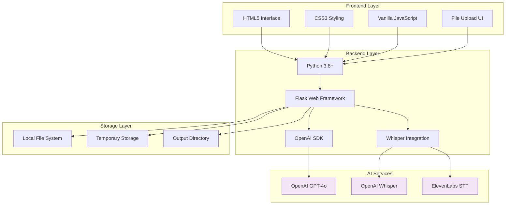

### **Technology Dependencies**

| Category | Technology | Version | Purpose |
|----------|------------|---------|---------|
| **Runtime** | Python | 3.8+ | Core language |
| **Web Framework** | Flask | 2.3.0+ | HTTP server & API |
| **AI Integration** | OpenAI SDK | 1.0.0+ | GPT-4o API access |
| **Audio Processing** | Whisper | Latest | Speech-to-text |
| **Environment** | python-dotenv | 1.0.0+ | Configuration |
| **Optional Services** | ElevenLabs API | - | Enhanced transcription |
| **Optional Services** | AWS Transcribe | - | Speaker diarization |

---

## 🔄 **System Architecture Evolution**

### **Phase 1: Current POC Architecture**


**Characteristics:**
- **Deployment:** Single server instance
- **Scaling:** Vertical only
- **Storage:** Local file system
- **Processing:** Synchronous, single-threaded
- **Security:** Basic file validation

### **Phase 2: MVP Architecture**

```mermaid
architecture-beta
    group frontend(logos:react)[Frontend]
    group api(logos:fastapi)[API Gateway]
    group services(logos:docker)[Microservices]
    group ai(logos:openai)[AI Services]
    group data(logos:postgresql)[Data Layer]
    
    service react(logos:react)[React UI] in frontend
    service gateway(logos:kong)[API Gateway] in api
    service auth(logos:auth0)[Auth Service] in services
    service processor(logos:python)[Processing Service] in services
    service gpt(logos:openai)[OpenAI APIs] in ai
    service postgres(logos:postgresql)[PostgreSQL] in data
    service redis(logos:redis)[Redis Cache] in data
    
    react:R --> L:gateway
    gateway:R --> L:auth
    gateway:R --> L:processor
    processor:R --> L:gpt
    processor:R --> L:postgres
    auth:R --> L:redis
```

### **Phase 3: Enterprise Architecture**

```mermaid
architecture-beta
    group clients(logos:devices)[Client Applications]
    group edge(logos:cloudflare)[Edge Layer]
    group orchestration(logos:kubernetes)[Orchestration]
    group agents(logos:ai)[AI Agent Network]
    group data(logos:database)[Data Infrastructure]
    group monitoring(logos:grafana)[Observability]
    
    service web(logos:chrome)[Web App] in clients
    service mobile(logos:mobile)[Mobile App] in clients
    service cdn(logos:cloudflare)[CDN] in edge
    service k8s(logos:kubernetes)[Kubernetes] in orchestration
    service research(logos:ai)[Research Agent] in agents
    service viz(logos:chart)[Viz Agent] in agents
    service slides(logos:presentation)[Slide Agent] in agents
    service postgres(logos:postgresql)[PostgreSQL] in data
    service vector(logos:database)[Vector DB] in data
    service metrics(logos:prometheus)[Prometheus] in monitoring
    service logs(logos:elastic)[ELK Stack] in monitoring
    
    web:R --> L:cdn
    mobile:R --> L:cdn
    cdn:R --> L:k8s
    k8s:R --> L:research
    k8s:R --> L:viz
    k8s:R --> L:slides
    research:R --> L:postgres
    viz:R --> L:vector
    k8s:R --> L:metrics
    k8s:R --> L:logs
```

---

## 🔧 **Core Components Deep Dive**

### **1. Web Application Layer (`web_app.py`)**

```mermaid
graph TB
    subgraph "Flask Application"
        A[Route Handlers]
        B[File Upload Manager]
        C[Processing Coordinator]
        D[Response Builder]
    end
    
    subgraph "API Endpoints"
        E[/process - Main processing]
        F[/transcribe_only - Transcription only]
        G[/export - Export presentations]
        H[/api/config - Configuration]
        I[/download/&lt;file&gt; - File serving]
    end
    
    subgraph "Processing Functions"
        J[transcribe_with_whisper]
        K[transcribe_with_elevenlabs]
        L[generate_markdown_content]
        M[combine_multiple_insights]
    end
    
    A --> E
    A --> F
    A --> G
    A --> H
    A --> I
    
    E --> J
    E --> K
    F --> J
    F --> K
    G --> L
    G --> M
    
    style A fill:#e1f5fe
    style J fill:#f3e5f5
    style K fill:#f3e5f5
```

### **2. Core Processing Engine (`main.py`)**

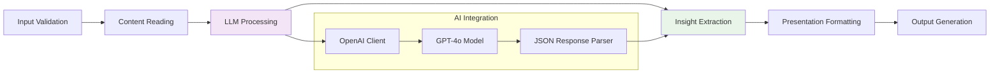

### **3. AI Processing Pipeline**

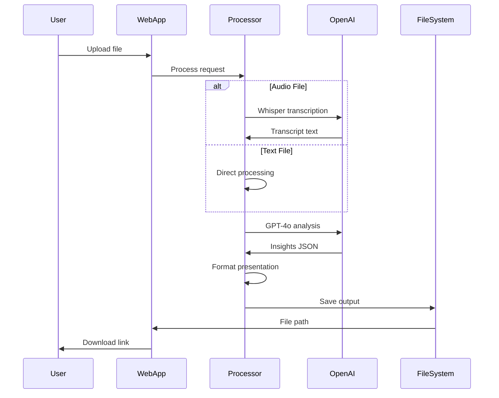

---

## 📊 **Data Flow Architecture**

### **Request Processing Flow**

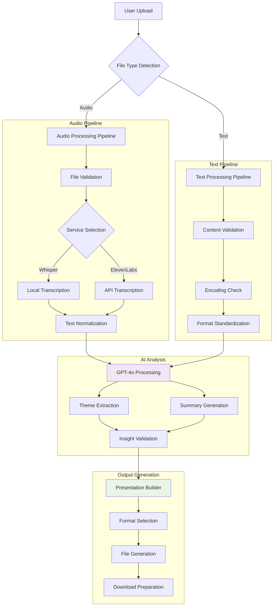

### **Data Models & Schema**

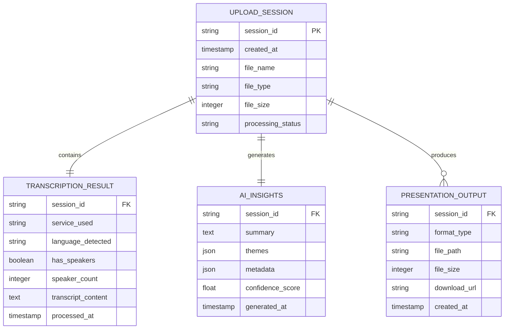

---

## 🛡️ **Security & Privacy Framework**

### **Security Architecture**

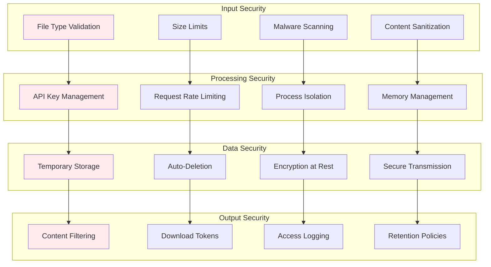

### **Privacy Controls**

| Layer | Control | Implementation |
|-------|---------|---------------|
| **Input** | File validation | Whitelist file types, size limits |
| **Processing** | Data isolation | Temporary directories, process separation |
| **Storage** | Automatic cleanup | 1-hour retention, secure deletion |
| **Transmission** | Encryption | TLS 1.3 for all API calls |
| **Logging** | Minimal data | No content logging, metadata only |

---

## ⚡ **Performance Architecture**

### **Processing Performance Profile**

```mermaid
gantt
    title Processing Time Breakdown (Average 5MB audio file)
    dateFormat  SS
    axisFormat %Ss
    
    section File Upload
    Upload & Validation    :upload, 00, 10s
    
    section Transcription
    Whisper Processing     :whisper, after upload, 60s
    ElevenLabs API         :elevenlabs, after upload, 30s
    
    section AI Analysis
    GPT-4o Processing      :gpt, after whisper, 45s
    Insight Extraction     :insights, after gpt, 15s
    
    section Output
    Presentation Building  :slides, after insights, 10s
    File Generation       :files, after slides, 5s
```

### **Optimization Strategies**

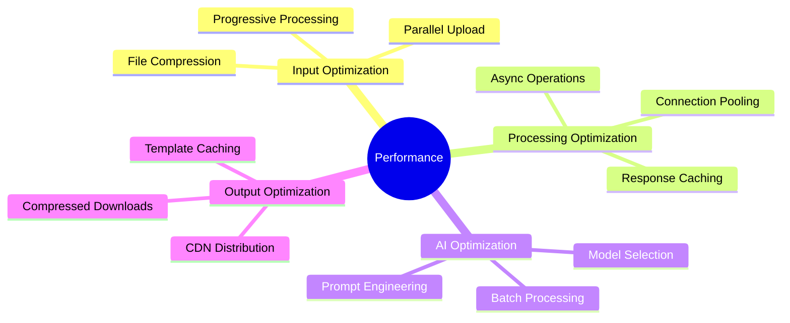

---

## 🚀 **Deployment Architecture**

### **Development Environment**

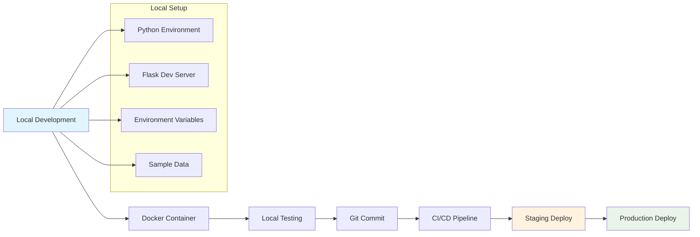

### **Production Deployment Options**

| Environment | Technology | Pros | Cons |
|-------------|------------|------|------|
| **Local/Desktop** | Python + Flask | Simple setup, no cloud costs | Limited scaling, single user |
| **Cloud VM** | AWS EC2/GCP Compute | Easy deployment, moderate scaling | Manual management required |
| **Container Platform** | Docker + K8s | Auto-scaling, high availability | Complex setup, higher costs |
| **Serverless** | AWS Lambda/GCP Functions | Zero maintenance, pay-per-use | Cold starts, limited processing time |

---

## 📈 **Scalability Planning**

### **Scaling Dimensions**

```mermaid
radar
    title Scalability Requirements
    "Concurrent Users" : [3, 7, 9]
    "File Size" : [6, 8, 9]
    "Processing Speed" : [7, 8, 9]
    "Storage Capacity" : [4, 6, 8]
    "AI API Limits" : [5, 7, 8]
    "Geographic Distribution" : [2, 5, 8]
```

**Legend:**
- Inner ring: Current POC capabilities
- Middle ring: MVP requirements
- Outer ring: Enterprise requirements

### **Enterprise Scaling Strategy**

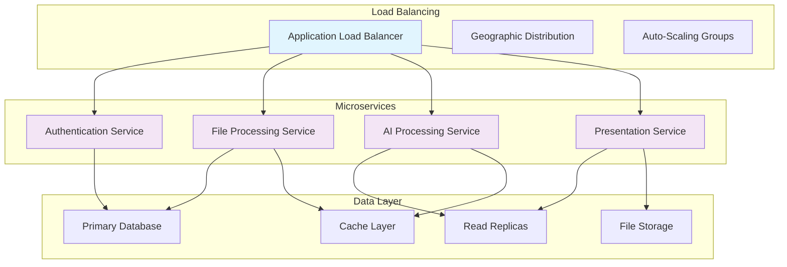

---

## 🔧 **Configuration Management**

### **Environment Configuration**

```yaml
# config/development.yaml
app:
  name: "InsightDeck Agent"
  version: "0.1.0"
  debug: true
  host: "127.0.0.1"
  port: 8080

ai_services:
  openai:
    model: "gpt-4o"
    max_tokens: 4000
    temperature: 0.3
  whisper:
    model: "base"
    language: "auto"
  elevenlabs:
    model: "eleven_turbo_v2_5"
    speakers: 8

storage:
  temp_dir: "/tmp/insightdeck"
  retention_hours: 1
  max_file_size: "100MB"

security:
  allowed_file_types: [".txt", ".mp3", ".wav", ".m4a"]
  max_upload_size: "100MB"
  rate_limit: "10/minute"
```

### **Feature Flags System**

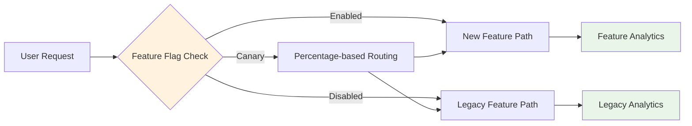

---

## 🔍 **Monitoring & Observability**

### **Monitoring Stack**

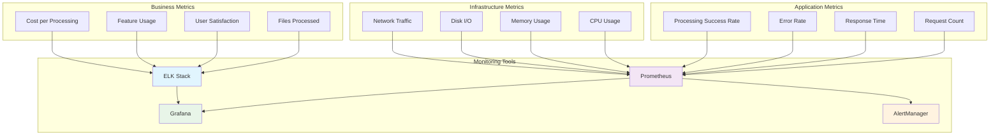

### **Health Check Strategy**

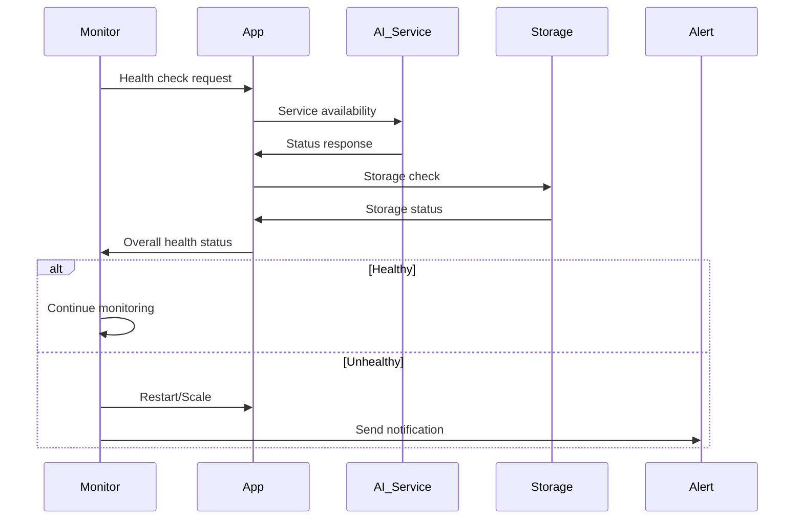

---

## 🔄 **API Design & Integration**

### **RESTful API Structure**

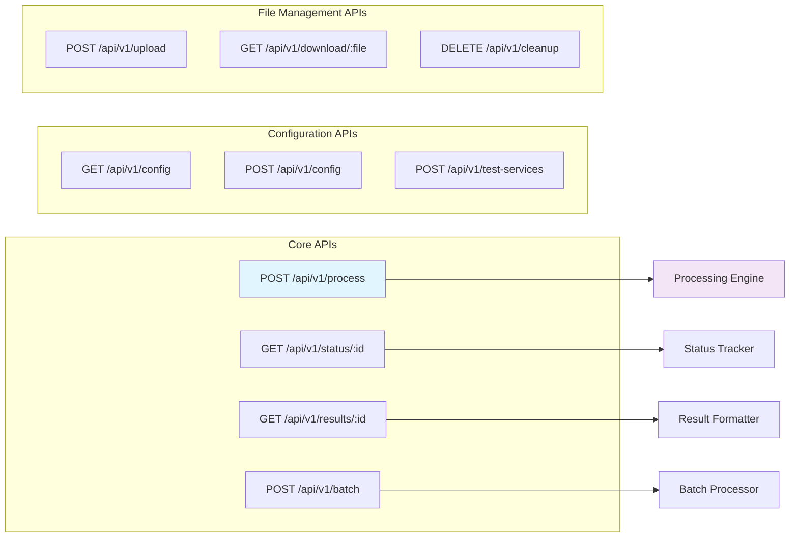

### **Integration Patterns**

```mermaid
flowchart TB
    subgraph "Webhook Integration"
        A[External System] --> B[Webhook Endpoint]
        B --> C[Process File]
        C --> D[Send Results]
        D --> A
    end
    
    subgraph "API Integration"
        E[Client Application] --> F[REST API]
        F --> G[Authentication]
        G --> H[Processing]
        H --> I[JSON Response]
        I --> E
    end
    
    subgraph "Batch Integration"
        J[Scheduled Job] --> K[Batch Endpoint]
        K --> L[Multi-file Processing]
        L --> M[Aggregate Results]
        M --> N[Report Generation]
    end
    
    style B fill:#e8f5e8
    style F fill:#e8f5e8
    style K fill:#e8f5e8
```

---

This technical framework documentation provides comprehensive coverage of the system architecture, technology stack, and implementation details needed for UXR team presentations and technical discussions.