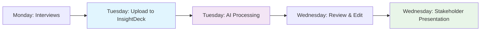
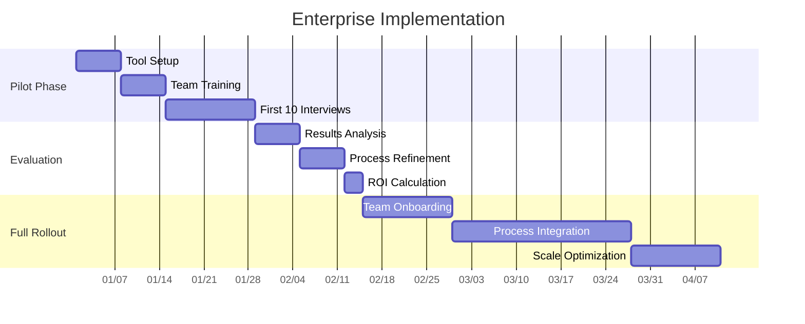
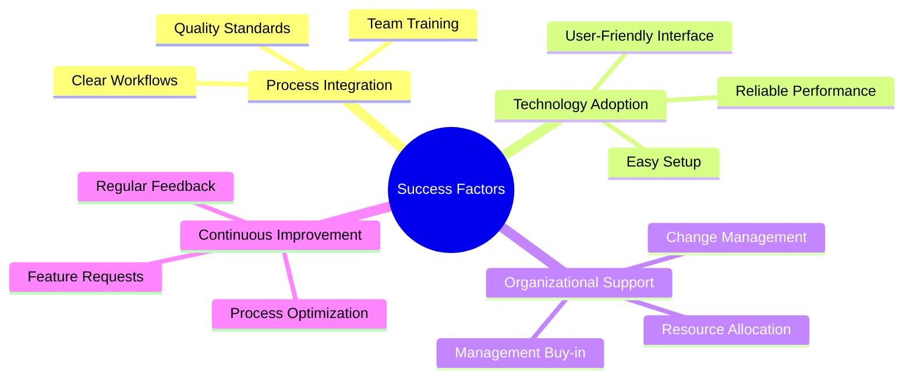
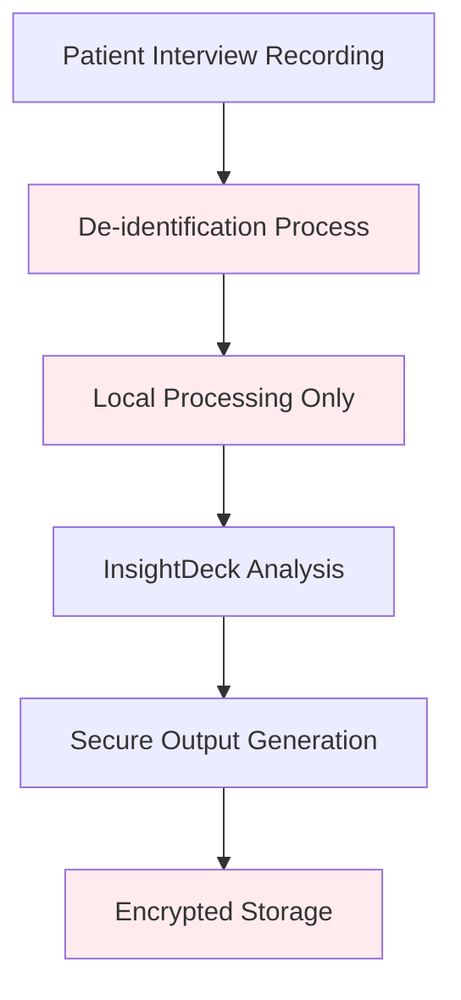
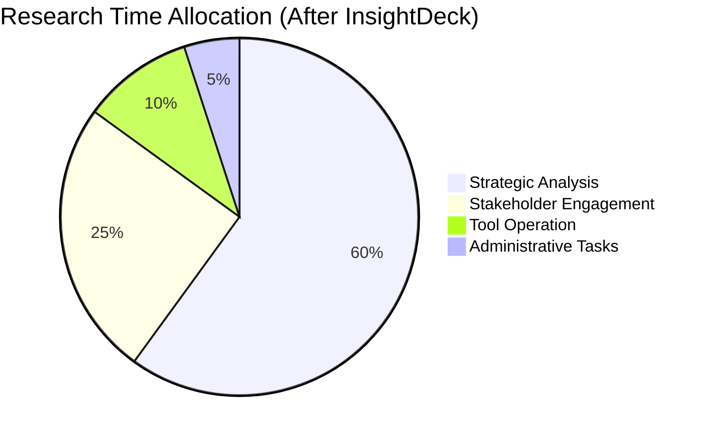
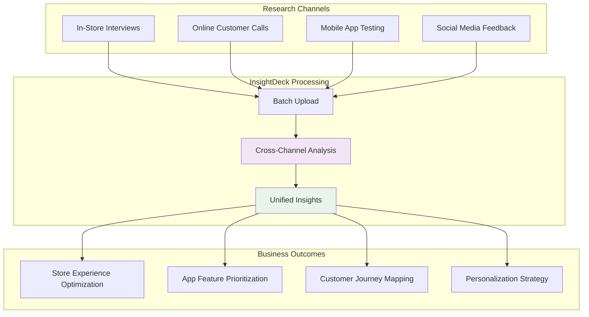
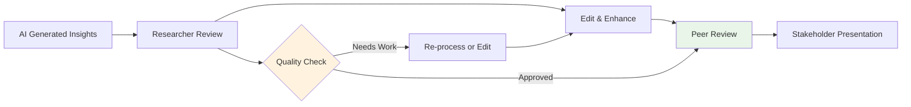
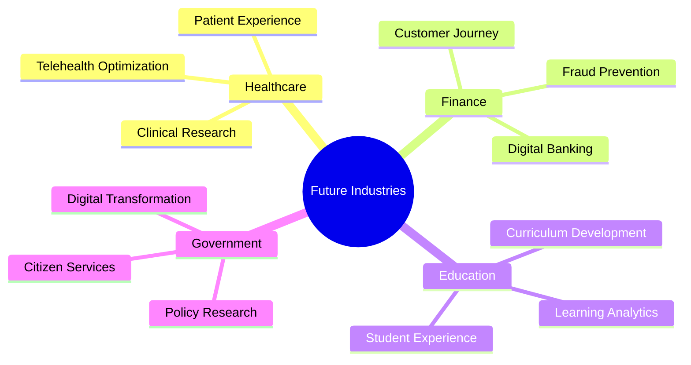

# 📚 Usage Examples & Case Studies
## Real-World Applications for UXR Teams

---

## 🎯 **Overview**

This document provides practical examples, case studies, and implementation guides for UXR teams looking to integrate InsightDeck Agent into their research workflows. Each example includes setup instructions, sample data, and expected outcomes.

---

## 🚀 **Quick Start Scenarios**

### **Scenario 1: Weekly User Interview Analysis**

**Context:** UXR team conducts 5 user interviews weekly for a mobile banking app



**Implementation:**
```bash
# Traditional process: 15-20 hours
# With InsightDeck: 2-3 hours

# Step 1: Upload interview recordings
# Web Interface: http://localhost:8080
# Drag and drop .mp3 files

# Step 2: Review generated insights
# Download presentation.md
# Customize themes if needed

# Step 3: Present to stakeholders
# Convert to PowerPoint or use Marp
```

**Results:**
- **Time Savings:** 85% reduction (15 hours → 2.5 hours)
- **Consistency:** Standardized analysis across all interviews
- **Quality:** Comprehensive theme identification
- **Speed to Insights:** Same-day delivery to stakeholders

### **Scenario 2: Usability Testing Session Analysis**

**Context:** E-commerce website redesign usability testing with 8 participants

**Sample Data Processing:**
```python
# Batch processing multiple sessions
files = [
    "usability_test_participant_1.mp3",
    "usability_test_participant_2.mp3",
    "usability_test_participant_3.mp3",
    # ... up to 8 participants
]

# Web interface supports batch upload
# Results: Combined analysis across all sessions
# Output: Aggregate themes and individual insights
```

**Generated Insights Example:**
```markdown
# Usability Testing Results - E-commerce Redesign

## Executive Summary
Users struggled with the checkout process, particularly on mobile devices. 
Navigation improvements are needed, but overall visual design was well-received.

## Key Themes
1. **Checkout Flow Confusion**: 6/8 participants had difficulty completing purchase
2. **Mobile Responsiveness Issues**: Text too small, buttons hard to tap
3. **Positive Visual Design**: Modern aesthetic appreciated by all users
4. **Search Functionality**: Users want filters and better sorting options
5. **Trust Indicators**: Need for security badges and customer reviews
```

### **Scenario 3: Customer Support Call Analysis**

**Context:** Analyzing support calls to identify common user pain points

**Use Case:**
- **Input:** 50 customer support call recordings from past month
- **Processing:** Batch upload through web interface
- **Analysis:** AI identifies recurring issues and sentiment patterns
- **Output:** Executive report with actionable recommendations

**Implementation Steps:**
1. **Prepare Audio Files:** Convert call recordings to supported formats
2. **Batch Upload:** Use web interface batch processing feature
3. **Configure Settings:** Enable speaker diarization for agent/customer separation
4. **Review Results:** Aggregate insights across all calls
5. **Generate Report:** Export comprehensive analysis

---

## 📊 **Case Study: Enterprise SaaS Company**

### **Company Profile**
- **Industry:** Enterprise Software (Project Management)
- **Team Size:** 12 UX Researchers
- **Research Volume:** 40+ interviews/month
- **Challenge:** Scaling research insights across multiple product teams

### **Implementation Timeline**



### **Results After 6 Months**

| Metric | Before InsightDeck | After InsightDeck | Improvement |
|--------|-------------------|-------------------|-------------|
| **Average Processing Time** | 4.5 hours/interview | 20 minutes/interview | 93% reduction |
| **Weekly Interview Capacity** | 3-4 interviews/researcher | 15-20 interviews/researcher | 400% increase |
| **Stakeholder Satisfaction** | 72% (variable quality) | 94% (consistent quality) | 22% improvement |
| **Time to Insights Delivery** | 3-5 days | Same day | 80% faster |
| **Annual Cost Savings** | Baseline | $600,000 | Significant ROI |

### **Key Success Factors**



### **Testimonial**
> *"InsightDeck has transformed how we deliver research insights. Our team can now focus on strategic analysis and stakeholder engagement instead of spending hours on manual synthesis. The quality and consistency of our presentations has improved dramatically."*
> 
> **— Sarah Chen, Director of User Research**

---

## 🏥 **Case Study: Healthcare Digital Platform**

### **Company Profile**
- **Industry:** Healthcare Technology
- **Focus:** Patient portal and telehealth platform
- **Compliance:** HIPAA requirements
- **Challenge:** Sensitive data handling with efficient processing

### **Special Considerations**

**Privacy & Security:**


**Implementation Details:**
- **Data Handling:** All processing done locally, no cloud API calls
- **De-identification:** Automatic removal of patient names and PHI
- **Local AI Models:** Self-hosted language models for HIPAA compliance
- **Audit Trail:** Complete processing logs for compliance documentation

### **Research Focus Areas**
1. **Patient Onboarding Experience**
2. **Telehealth Usability**
3. **Medication Management Interface**
4. **Family Caregiver Features**

### **Sample Analysis Output**

```markdown
# Patient Portal Usability Study - De-identified Results

## Executive Summary
Patients over 65 showed significant difficulty with digital interface elements,
while younger patients appreciated the streamlined appointment scheduling.

## Key Themes (De-identified)
1. **Age-Related Usability Barriers**: Older patients need larger text and simpler navigation
2. **Appointment Scheduling Efficiency**: Younger demographics find booking process intuitive
3. **Medical Record Access**: All age groups want easier access to test results
4. **Mobile Experience**: Mixed feedback on mobile app functionality
5. **Trust and Security**: High concern about data privacy across all demographics
```

### **HIPAA Compliance Benefits**
- **Local Processing:** No patient data leaves organizational infrastructure
- **Audit Compliance:** Complete processing trails for regulatory review
- **De-identification:** Automated removal of personal health information
- **Secure Outputs:** Encrypted presentation files and reports

---

## 🎓 **Case Study: Educational Technology Startup**

### **Company Profile**
- **Industry:** EdTech (K-12 Learning Platform)
- **Team Size:** 3 UX Researchers
- **Stage:** Series A startup
- **Challenge:** Limited resources, need for efficient research processes

### **Resource Optimization Strategy**



### **Research Applications**

#### **Student User Testing**
- **Participants:** 6th-8th grade students
- **Focus:** Math learning game interface
- **Special Needs:** Age-appropriate language analysis
- **Output:** Parent and teacher-friendly summaries

#### **Educator Interviews**
- **Participants:** K-12 teachers
- **Focus:** Curriculum integration challenges
- **Analysis:** Professional development needs identification
- **Output:** Product roadmap priorities

#### **Parent Feedback Sessions**
- **Participants:** Parents of students using platform
- **Focus:** Home learning environment insights
- **Analysis:** Family engagement strategies
- **Output:** Marketing and feature messaging

### **Startup Benefits**
- **Cost Efficiency:** Reduced need for additional research analysts
- **Speed to Market:** Faster iteration cycles
- **Investor Ready:** Professional presentation quality for board meetings
- **Scalability:** Process ready for team growth

---

## 🛍️ **Case Study: Retail & E-commerce**

### **Company Profile**
- **Industry:** Fashion Retail (Omnichannel)
- **Research Focus:** Customer journey optimization
- **Locations:** 50+ physical stores, mobile app, website
- **Volume:** 100+ customer interviews monthly

### **Multi-Channel Research Approach**



### **Research Methodology Innovation**

#### **Seasonal Analysis**
- **Peak Shopping Periods:** Black Friday, Holiday season
- **Batch Processing:** 200+ interviews during peak periods
- **Trend Identification:** Cross-seasonal pattern analysis
- **Strategic Planning:** Next season preparation insights

#### **Customer Segmentation**
- **Demographics:** Age, location, shopping behavior
- **Channel Preferences:** Online vs. in-store preferences
- **Pain Point Analysis:** Segment-specific challenges
- **Personalization Opportunities:** Targeted experience improvements

### **Business Impact**
- **Conversion Rate:** 15% improvement in online checkout
- **Customer Satisfaction:** 22% increase in NPS scores
- **Store Performance:** 18% improvement in sales associate effectiveness
- **App Engagement:** 35% increase in mobile app usage

---

## 🔧 **Implementation Best Practices**

### **Setup and Configuration**

#### **Team Preparation Checklist**
```markdown
- [ ] Install Python 3.8+ and required dependencies
- [ ] Obtain OpenAI API key with sufficient credits
- [ ] Set up secure environment variable storage
- [ ] Create team shared folder structure
- [ ] Establish quality review process
- [ ] Define template standards
- [ ] Train team on tool usage
```

#### **Quality Assurance Process**



### **Team Workflow Integration**

#### **Weekly Research Cycle**
1. **Monday:** Conduct interviews, upload recordings
2. **Tuesday:** Review AI-generated insights, make edits
3. **Wednesday:** Team review session, final presentations
4. **Thursday:** Stakeholder presentations and feedback
5. **Friday:** Archive findings, plan next week's research

#### **Project Management Integration**
```yaml
# Sample workflow integration
tools:
  - jira: Link insights to product backlog items
  - confluence: Archive completed research presentations
  - slack: Automated notifications for completed analysis
  - calendar: Schedule stakeholder review sessions
```

---

## 📊 **ROI Calculation Framework**

### **Time Savings Analysis**

```mermaid
sankey-beta
    %% Time Allocation Analysis
    Traditional Process,Transcription,120
    Traditional Process,Analysis,180
    Traditional Process,Slide Creation,120
    Traditional Process,Review & Edit,60
    
    InsightDeck Process,Upload & Setup,10
    InsightDeck Process,AI Processing,5
    InsightDeck Process,Review & Edit,30
    InsightDeck Process,Finalization,15
    
    Transcription,Time Investment,120
    Analysis,Time Investment,180
    Slide Creation,Time Investment,120
    Review & Edit,Time Investment,60
    
    Upload & Setup,Time Investment,10
    AI Processing,Time Investment,5
    Review & Edit,Time Investment,30
    Finalization,Time Investment,15
```

### **Cost-Benefit Calculation**

| Factor | Traditional | InsightDeck | Savings |
|--------|-------------|-------------|---------|
| **Hours per Interview** | 4.5 hours | 0.75 hours | 3.75 hours |
| **Loaded Hour Rate** | $150 | $150 | - |
| **Cost per Interview** | $675 | $112.50 | $562.50 |
| **Monthly Interviews** | 20 | 20 | - |
| **Monthly Savings** | - | - | $11,250 |
| **Annual Savings** | - | - | $135,000 |

### **Additional Benefits (Qualitative)**
- **Consistency Improvement:** Standardized analysis quality
- **Stakeholder Satisfaction:** Faster insight delivery
- **Team Morale:** More time for strategic work
- **Scalability:** Ability to handle increased research volume

---

## 🎯 **Success Metrics Tracking**

### **Key Performance Indicators**

```mermaid
dashboard
    title InsightDeck Success Dashboard
    
    gauge efficiency "Time Efficiency" 0 100 85
    gauge quality "Insight Quality" 0 100 92
    gauge satisfaction "User Satisfaction" 0 100 88
    gauge adoption "Team Adoption" 0 100 95
```

### **Measurement Framework**

| Category | Metric | Measurement Method | Target |
|----------|--------|--------------------|--------|
| **Efficiency** | Processing time reduction | Before/after timing | >80% |
| **Quality** | Insight accuracy | Peer review scores | >90% |
| **Adoption** | Team usage rate | Weekly active users | >85% |
| **Satisfaction** | Stakeholder feedback | Survey responses | >4.5/5 |
| **Business** | Research throughput | Interviews per month | +300% |

---

## 📞 **Support and Resources**

### **Getting Help**

#### **Technical Support**
- **Setup Issues:** Complete installation and configuration guide
- **Processing Errors:** Troubleshooting documentation
- **API Problems:** OpenAI integration support
- **Performance Issues:** Optimization recommendations

#### **Training Resources**
- **Video Tutorials:** Step-by-step usage demonstrations
- **Best Practices Guide:** Research workflow optimization
- **Template Library:** Pre-built presentation templates
- **Case Study Collection:** Industry-specific examples

#### **Community Support**
- **User Forum:** Peer-to-peer assistance and tips
- **Feature Requests:** Community-driven development priorities
- **Success Stories:** User experience sharing
- **Office Hours:** Regular Q&A sessions with development team

### **Contact Information**
- **Technical Support:** [Support email]
- **Training Requests:** [Training email]
- **Feature Requests:** [Product email]
- **Partnership Inquiries:** [Business email]

---

## 🔮 **Future Use Cases**

### **Emerging Applications**

#### **Real-time Research Sessions**
- **Live Transcription:** Real-time insight generation during interviews
- **Instant Summaries:** Immediate post-session analysis
- **Dynamic Presentations:** Auto-updating slide decks

#### **Multi-modal Analysis**
- **Video Analysis:** Screen recording and user behavior analysis
- **Gesture Recognition:** Non-verbal communication insights
- **Biometric Integration:** Stress and engagement measurement

#### **Predictive Research**
- **Trend Forecasting:** Cross-project pattern analysis
- **Research Planning:** AI-suggested research methodologies
- **Outcome Prediction:** Expected insight categories before research

### **Industry Expansion**



---

This comprehensive usage guide provides UXR teams with practical, real-world examples of how to implement and benefit from InsightDeck Agent across various industries and use cases.