# UXR Synthesizer - Agent Architecture

## Overview

This document details the current analysis system and the **roadmap for multi-agent capabilities**. The project uses a single-agent GPT-4o analysis today, with multi-agent prototypes designed for future integration.

---

## Current Implementation Status

| System | Status | Framework | File |
|--------|--------|-----------|------|
| **Single-Agent Analysis** | ✅ **ACTIVE** | OpenAI GPT-4o | `main.py` (used by web_app.py) |
| Enhanced Analysis | ⚠️ Available, not connected | OpenAI GPT-4o | `main_enhanced.py` |
| LangGraph Multi-Agent | 🔄 **PROTOTYPE** | LangChain + LangGraph | `.cerebras_temp/langgraph_agent.py` |
| ADK Live Session | 🔄 **PROTOTYPE** | Google ADK | `adk_live_session.py` |

### What's Actually Running Today

```
Audio Upload → Whisper API → GPT-4o (basic prompt) → Summary + Themes → Marp Slides
```

The multi-agent systems (LangGraph, ADK) exist as **standalone prototypes** that are not yet integrated into the main Flask application.

---

## Roadmap

### Phase 1: Enhanced Single-Agent (Quick Win)
- [ ] Switch `web_app.py` import from `main.py` to `main_enhanced.py`
- [ ] Get richer outputs: pain points, user quotes, recommendations

### Phase 2: Multi-Agent Integration
- [ ] Wire LangGraph workflow into Flask routes
- [ ] Add `/api/deep-analysis` endpoint for multi-agent processing
- [ ] Enable synthetic persona interviews

### Phase 3: Real-Time Sessions
- [ ] Integrate ADK WebSocket handler
- [ ] Add live transcription with real-time insights
- [ ] Build live dashboard UI

---

## Architecture Diagrams

### Current System (What's Running)


### Planned: Multi-Agent System (Prototype Ready)


---

## Prototype: LangGraph Multi-Agent Workflow

```mermaid
flowchart TB
    subgraph Entry["🚀 Entry Point"]
        START[Start Research]
    end

    subgraph Config["🔧 Configuration Node"]
        C1[Generate Interview Questions]
        C2[Set Research Parameters]
    end

    subgraph Transcription["🎤 Transcription Node"]
        T1{Has Transcript?}
        T2[Use Existing]
        T3[Call Whisper API]
    end

    subgraph Analysis["🔍 Research Analyst Agent"]
        A1[Analyze Transcript]
        A2[Extract Key Themes]
        A3[Identify Patterns]
    end

    subgraph Personas["🎭 Persona Generator Agent"]
        P1[Create 5 Diverse Personas]
        P2[Define Traits & Backgrounds]
        P3[Set Communication Styles]
    end

    subgraph Interview["💬 Interview Agent"]
        I1[Conduct Interview]
        I2[Generate Authentic Responses]
        I3[Track Q&A History]
        I4{More Questions?}
        I5{More Personas?}
    end

    subgraph Synthesis["📊 Synthesis Agent"]
        S1[Analyze All Interviews]
        S2[Cross-Reference Themes]
        S3[Generate Recommendations]
        S4[Create Final Report]
    end

    START --> Config
    Config --> C1 --> C2
    C2 --> Transcription
    Transcription --> T1
    T1 -->|Yes| T2
    T1 -->|No| T3
    T2 --> Analysis
    T3 --> Analysis
    Analysis --> A1 --> A2 --> A3
    A3 --> Personas
    Personas --> P1 --> P2 --> P3
    P3 --> Interview
    Interview --> I1 --> I2 --> I3 --> I4
    I4 -->|Yes| I1
    I4 -->|No| I5
    I5 -->|Yes| I1
    I5 -->|No| Synthesis
    Synthesis --> S1 --> S2 --> S3 --> S4
    S4 --> END[Complete]

    style Config fill:#e3f2fd
    style Analysis fill:#fff3e0
    style Personas fill:#f3e5f5
    style Interview fill:#e8f5e9
    style Synthesis fill:#fce4ec
```



### Agent Communication Flow


### ADK Live Session Architecture

```mermaid
flowchart TB
    subgraph Client["🖥️ Frontend Client"]
        WS[WebSocket Connection]
        UI[Live Dashboard]
    end

    subgraph Server["🔌 WebSocket Handler"]
        WSH[ADKResearchWebSocketHandler]
        SM[Session Manager]
    end

    subgraph Session["📊 LiveResearchSession"]
        SC[Session Config]
        TC[Transcript Chunks]
        INS[Insights Store]
    end

    subgraph Agents["🤖 ADK Agents"]
        RA[Research Analyst Agent]
        DVA[Data Visualization Agent]
    end

    subgraph Processing["⚙️ Real-Time Processing"]
        STT[Speech-to-Text]
        TA[Theme Analysis]
        SA[Sentiment Analysis]
        AI[Action Item Extraction]
    end

    WS <-->|Audio Chunks| WSH
    WSH --> SM
    SM --> Session
    Session --> SC
    Session --> TC
    Session --> INS

    TC --> RA
    RA --> TA
    RA --> SA
    RA --> AI

    TA --> INS
    SA --> INS
    AI --> INS

    INS --> DVA
    DVA -->|Live Charts| UI
```



### Agent Type Comparison


---

## Agent Definitions

### 1. Research Analyst Agent

**Purpose:** Analyzes transcripts to extract UX insights

**Model:** Claude 3.5 Sonnet / GPT-4o

**Prompt:**
```
You are an expert UX research analyst. Analyze this user research transcript
and extract key themes.

Research Question: {research_question}
Target Demographic: {target_demographic}

Transcript:
{transcript}

Extract 5-7 key themes that emerged from this conversation. Each theme should be:
- Specific and actionable
- Supported by the transcript
- Relevant to the research question

Return as a JSON object with a "themes" array.
```

**Output Schema:**
```json
{
  "themes": [
    "Theme 1 with supporting evidence",
    "Theme 2 with user quote",
    "Theme 3 actionable insight"
  ]
}
```

---

### 2. Persona Generator Agent

**Purpose:** Creates diverse, realistic user personas for synthetic interviews

**Model:** Claude 3.5 Sonnet (structured output)

**Prompt:**
```
Generate exactly {num_personas} unique, realistic personas for user research interviews.

Target Demographic: {target_demographic}
Research Context: {research_question}

Requirements:
- Each persona should be distinct and realistic
- Represent diverse perspectives within the demographic
- Include personality traits that affect how they'd respond
- Make them believable, not stereotypes

Return as JSON matching the PersonasList schema.
```

**Output Schema:**
```json
{
  "personas": [
    {
      "name": "Alex Chen",
      "age": 28,
      "job": "Software Engineer",
      "traits": ["analytical", "detail-oriented", "pragmatic"],
      "communication_style": "direct and technical",
      "background": "5 years experience in SaaS products"
    }
  ]
}
```

---

### 3. Interview Agent

**Purpose:** Conducts synthetic interviews by role-playing as personas

**Model:** Claude 3.5 Sonnet

**Prompt:**
```
You are {persona.name}, a {persona.age}-year-old {persona.job}.
Your personality traits: {persona.traits}
Your communication style: {persona.communication_style}
Your background: {persona.background}

Answer this question in 2-3 sentences, staying authentic to your character:

Question: {question}

Be realistic, conversational, and honest. Don't be overly positive or negative - just genuine.
```

**Behavior:**
- Maintains persona consistency across questions
- Generates follow-up responses when needed
- Tracks interview history for context

---

### 4. Synthesis Agent

**Purpose:** Analyzes all interviews and generates comprehensive insights

**Model:** Claude 3.5 Sonnet

**Prompt:**
```
Analyze these user research interviews and provide a comprehensive synthesis.

{interview_summary}

Provide:
1. KEY THEMES: Main patterns and common themes across all interviews
2. DIVERSE PERSPECTIVES: Different viewpoints and unique insights
3. PAIN POINTS & OPPORTUNITIES: Challenges and improvement opportunities
4. ACTIONABLE RECOMMENDATIONS: Specific, implementable suggestions

Make it thorough, well-organized, and actionable.
```

---

### 5. Live Research Analyst Agent (ADK)

**Purpose:** Real-time analysis during live sessions

**Model:** Gemini 2.0 Flash

**Instruction:**
```
You are an expert UX researcher analyzing live conversations. Your tasks:

1. REAL-TIME THEME IDENTIFICATION:
   - Identify emerging themes as conversations develop
   - Track recurring patterns and pain points
   - Note user emotions and frustrations

2. SENTIMENT ANALYSIS:
   - Monitor speaker emotions and engagement
   - Identify moments of confusion, excitement, or frustration
   - Track sentiment shifts throughout the session

3. ACTION ITEMS:
   - Extract actionable insights for product teams
   - Identify feature requests and improvement opportunities
   - Note critical quotes for stakeholder presentations

4. LIVE INSIGHTS:
   - Provide immediate feedback to researchers
   - Suggest follow-up questions in real-time
   - Alert to important moments requiring attention

Return structured JSON with insights for real-time processing.
```

---

### 6. Data Visualization Agent (ADK)

**Purpose:** Generates real-time charts and dashboards

**Model:** Gemini 2.0 Flash

**Outputs:**
- Theme frequency charts
- Sentiment timeline
- Speaker participation metrics
- Live insight counters

---

## State Management

### LangGraph ResearchState

```python
class ResearchState(TypedDict):
    # Input configuration
    research_question: str
    target_demographic: str
    audio_file: Optional[str]

    # Transcription results
    transcript: str
    speakers: Optional[List[Dict]]
    has_real_transcript: bool

    # Generated data
    personas: List[Persona]
    interview_questions: List[str]

    # Interview tracking
    current_persona_index: int
    current_question_index: int
    current_interview_history: List[Dict]

    # Results storage
    all_interviews: List[Dict]
    key_themes: List[str]
    insights: Dict
    synthesis: str

    # Metadata
    processing_time: float
    agent_calls: List[str]
```

---

## Workflow Routing

### Interview Router Logic


```python
def interview_router(state: ResearchState) -> str:
    """Route between continuing interviews or moving to synthesis"""
    if not state.get('personas'):
        return "synthesize"

    if state['current_persona_index'] >= len(state['personas']):
        return "synthesize"
    else:
        return "interview"
```

---

## Model Selection Strategy

| Task | Model | Reason |
|------|-------|--------|
| Theme Extraction | Claude 3.5 Sonnet | Deep reasoning, nuanced analysis |
| Persona Generation | Claude 3.5 Sonnet | Creative, consistent characters |
| Interview Responses | Claude 3.5 Sonnet | Authentic, persona-consistent |
| Synthesis | Claude 3.5 Sonnet | Comprehensive analysis |
| Real-Time Analysis | Gemini 2.0 Flash | Speed for live processing |
| Transcription | OpenAI Whisper | Accuracy + cost efficiency |

---

## Data Flow: End-to-End

```mermaid
flowchart TB
    subgraph Input["📥 Input"]
        A1[Audio File]
        A2[Research Question]
        A3[Target Demographic]
    end

    subgraph Processing["⚙️ Multi-Agent Processing"]
        B1[Transcription]
        B2[Theme Extraction]
        B3[Persona Generation]
        B4[Synthetic Interviews]
        B5[Cross-Analysis]
    end

    subgraph Output["📤 Output"]
        C1[Key Themes]
        C2[Pain Points]
        C3[User Quotes]
        C4[Recommendations]
        C5[Marp Presentation]
    end

    A1 --> B1
    A2 --> B2
    A3 --> B3
    B1 --> B2
    B2 --> B3
    B3 --> B4
    B4 --> B5
    B5 --> C1
    B5 --> C2
    B5 --> C3
    B5 --> C4
    C1 & C2 & C3 & C4 --> C5
```



---

## Future Agent Expansions

### Planned Agents

1. **Competitive Analysis Agent**
   - Compare findings against competitor products
   - Benchmark UX patterns

2. **Accessibility Audit Agent**
   - Flag accessibility concerns in user feedback
   - WCAG compliance suggestions

3. **Trend Analysis Agent**
   - Track themes over multiple sessions
   - Identify emerging patterns

4. **Report Writer Agent**
   - Generate stakeholder-ready reports
   - Create executive summaries

---

## Integration Points

### Adding a New Agent to LangGraph

```python
# 1. Define the agent node
def new_agent_node(state: ResearchState) -> Dict:
    llm = get_llm("claude")
    prompt = "Your agent prompt here..."
    response = llm.invoke([{"role": "user", "content": prompt}])
    return {"new_field": response.content}

# 2. Add to workflow
workflow.add_node("new_agent", new_agent_node)

# 3. Define edges
workflow.add_edge("previous_node", "new_agent")
workflow.add_edge("new_agent", "next_node")
```

### Adding Real-Time Analysis with ADK

```python
# 1. Create agent class
class NewRealtimeAgent:
    def __init__(self):
        self.name = "NewAgent"
        self.model = "gemini-2.0-flash"
        self.instruction = "Your real-time analysis prompt..."

    def analyze(self, chunk: str) -> List[LiveInsight]:
        # Analysis logic
        pass

# 2. Register with session
session.new_agent = NewRealtimeAgent()

# 3. Call in processing loop
insights = session.new_agent.analyze(transcript_chunk)
```

---

## Cost Considerations

| Agent Call | Model | Est. Cost |
|------------|-------|-----------|
| Research Analyst | Claude Sonnet | ~$0.02/call |
| Persona Generator | Claude Sonnet | ~$0.03/call |
| Interview (per Q) | Claude Sonnet | ~$0.01/call |
| Synthesis | Claude Sonnet | ~$0.04/call |
| Live Analysis | Gemini Flash | ~$0.001/call |

**Typical Full Run (5 personas, 5 questions):**
- Config: $0.02
- Analysis: $0.02
- Personas: $0.03
- Interviews: 25 x $0.01 = $0.25
- Synthesis: $0.04
- **Total: ~$0.36**

---

*Generated for portfolio documentation*
