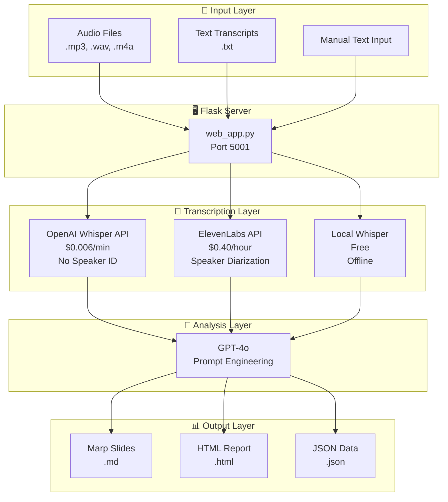
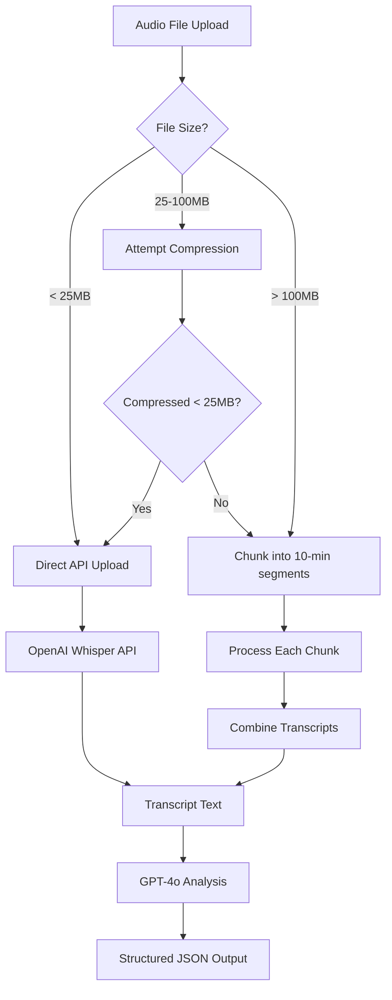
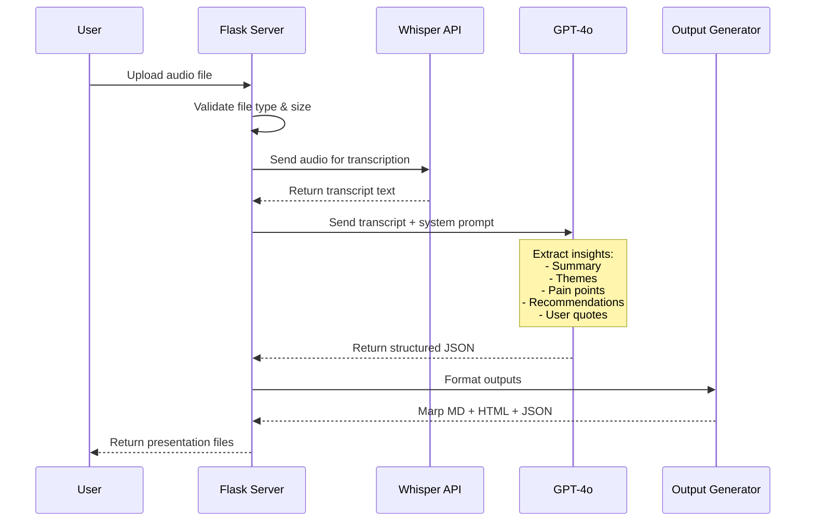
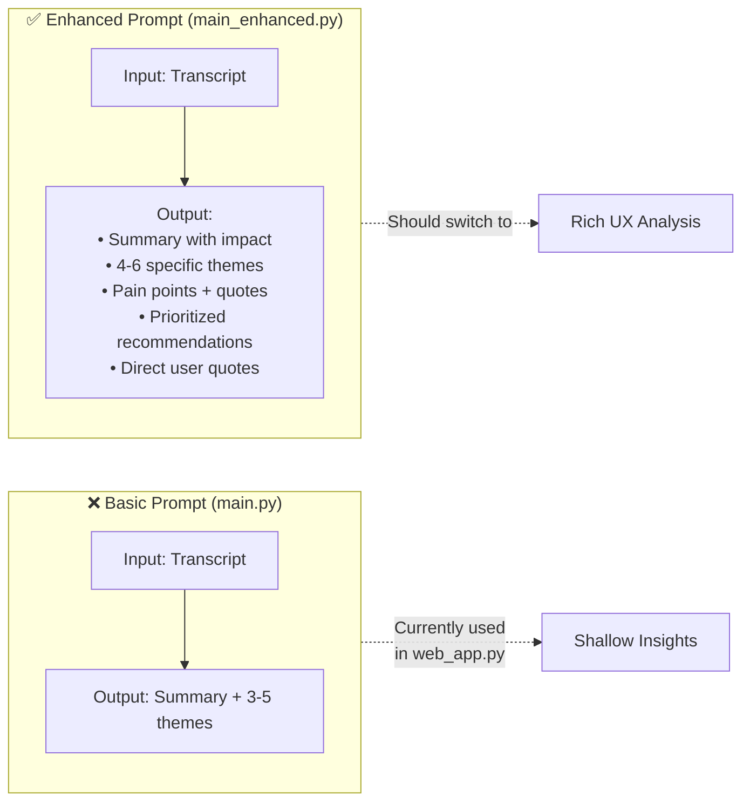
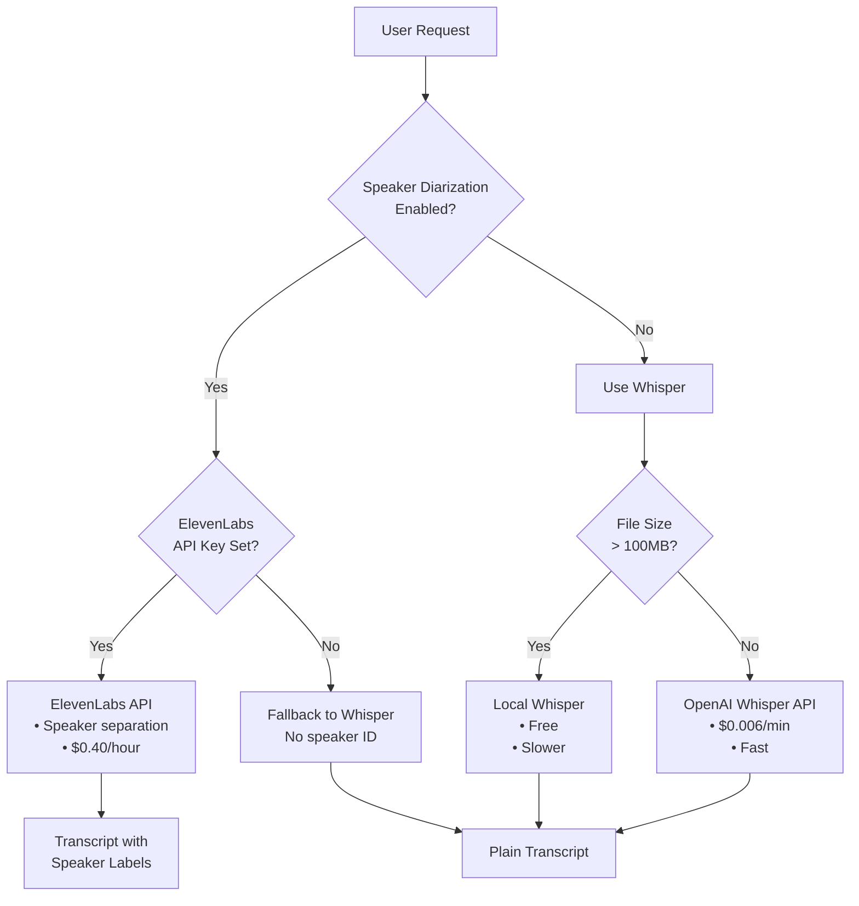
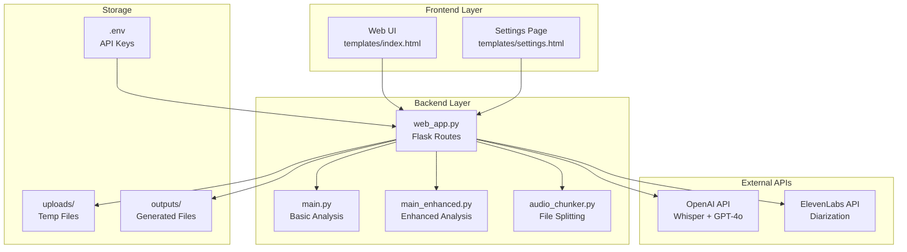

# UXR Synthesizer - Technical Architecture

## Overview

UXR Synthesizer is an AI-powered tool that transforms user research audio/transcripts into actionable UX insights and presentations. This document breaks down the technical architecture for portfolio reference.

---

## Mermaid Diagrams

### High-Level System Flow



### File Size Routing Logic



### Analysis Pipeline Detail



### Prompt Engineering Comparison



### Service Selection Logic



### Component Architecture



---

## System Architecture (ASCII)

```
┌─────────────────────────────────────────────────────────────────┐
│                     UXR SYNTHESIZER PIPELINE                    │
├─────────────────────────────────────────────────────────────────┤
│                                                                 │
│  📁 Input Layer                                                 │
│  ├── Audio files (.mp3, .wav, .m4a, .mp4, .flac, .ogg)         │
│  ├── Text transcripts (.txt)                                    │
│  └── Manual text input                                          │
│       │                                                         │
│       ▼                                                         │
│  ┌─────────────────┐                                            │
│  │ web_app.py      │  Flask Server (Port 5001)                  │
│  │ Entry Point     │  Handles uploads, routing, exports         │
│  └────────┬────────┘                                            │
│           │                                                     │
│           ▼                                                     │
│  ┌─────────────────────────────────────────────────────────┐   │
│  │              TRANSCRIPTION LAYER                         │   │
│  │                                                          │   │
│  │  ┌──────────────┐  ┌──────────────┐  ┌──────────────┐   │   │
│  │  │ OpenAI       │  │ ElevenLabs   │  │ Local        │   │   │
│  │  │ Whisper API  │  │ API          │  │ Whisper      │   │   │
│  │  ├──────────────┤  ├──────────────┤  ├──────────────┤   │   │
│  │  │ Cost:        │  │ Cost:        │  │ Cost:        │   │   │
│  │  │ $0.006/min   │  │ $0.40/hour   │  │ Free         │   │   │
│  │  ├──────────────┤  ├──────────────┤  ├──────────────┤   │   │
│  │  │ Max: 25MB    │  │ Speaker      │  │ No size      │   │   │
│  │  │ Fast cloud   │  │ Diarization  │  │ limit        │   │   │
│  │  │ processing   │  │ supported    │  │ Slower       │   │   │
│  │  └──────────────┘  └──────────────┘  └──────────────┘   │   │
│  │                                                          │   │
│  │  Smart File Handling:                                    │   │
│  │  • < 25MB  → Direct API upload                          │   │
│  │  • 25-100MB → Compression attempt → Chunking fallback   │   │
│  │  • > 100MB → Automatic chunking (10-min segments)       │   │
│  └─────────────────────────────────────────────────────────┘   │
│           │                                                     │
│           ▼                                                     │
│  ┌─────────────────────────────────────────────────────────┐   │
│  │              ANALYSIS LAYER (GPT-4o)                     │   │
│  │                                                          │   │
│  │  System Prompt Engineering:                              │   │
│  │  ┌────────────────────────────────────────────────────┐ │   │
│  │  │ • Role: Senior UX Researcher                       │ │   │
│  │  │ • Task: Extract actionable insights                │ │   │
│  │  │ • Output: Structured JSON                          │ │   │
│  │  │                                                    │ │   │
│  │  │ Extracts:                                          │ │   │
│  │  │ ├── Executive summary                              │ │   │
│  │  │ ├── Key UX themes (4-6)                            │ │   │
│  │  │ ├── Pain points with user quotes                   │ │   │
│  │  │ ├── Prioritized recommendations                    │ │   │
│  │  │ └── Direct user quotes                             │ │   │
│  │  └────────────────────────────────────────────────────┘ │   │
│  └─────────────────────────────────────────────────────────┘   │
│           │                                                     │
│           ▼                                                     │
│  ┌─────────────────────────────────────────────────────────┐   │
│  │              OUTPUT LAYER                                │   │
│  │                                                          │   │
│  │  ┌────────────┐  ┌────────────┐  ┌────────────┐         │   │
│  │  │ Marp       │  │ HTML       │  │ JSON       │         │   │
│  │  │ Slides     │  │ Report     │  │ Data       │         │   │
│  │  │ (.md)      │  │ (.html)    │  │ (.json)    │         │   │
│  │  └────────────┘  └────────────┘  └────────────┘         │   │
│  └─────────────────────────────────────────────────────────┘   │
└─────────────────────────────────────────────────────────────────┘
```

---

## Key Files & Their Purposes

| File | Purpose | Key Functions |
|------|---------|---------------|
| `web_app.py` | Main Flask server | Routes, file handling, transcription orchestration |
| `main.py` | Basic analysis | `get_insights_from_llm()` - simple prompt |
| `main_enhanced.py` | Rich analysis | `get_insights_from_llm()` - detailed UX-focused prompt |
| `audio_chunker.py` | Large file handling | Splits audio into 10-min chunks for API limits |

---

## Prompt Engineering Deep Dive

### Basic Prompt (`main.py:18-23`)

```python
system_prompt = """
You are an expert user research analyst. Your task is to analyze the provided
transcript and extract a concise summary and the top 3-5 key themes.
Return the output as a valid JSON object with two keys: "summary" and "themes".
The "themes" value should be a list of strings.
"""
```

**Output:** Summary + 3-5 generic themes

**Limitation:** No quotes, no pain points, no actionable recommendations

---

### Enhanced Prompt (`main_enhanced.py:99-129`)

```python
system_prompt = """
You are a senior UX researcher with expertise in user experience design
and behavioral analysis.

Analyze this user research transcript and extract specific, actionable
UX insights grounded in what users actually said:

CRITICAL ANALYSIS REQUIREMENTS:
1. QUOTE ACTUAL USER WORDS - Include direct quotes that support each insight
2. BE SPECIFIC - Avoid generic UX statements like "users want better navigation"
3. IDENTIFY ROOT CAUSES - Don't just list complaints, explain underlying UX problems
4. PRIORITIZE BY IMPACT - Focus on issues that affect core user workflows

ANALYZE FOR:
- Specific usability failures: "I clicked X expecting Y but got Z"
- Emotional reactions: frustration, confusion, delight expressed by users
- Mental model mismatches: where user expectations don't match interface behavior
- Workflow interruptions: specific points where users get stuck or lose efficiency
- Feature gaps: explicit requests for missing functionality
- Accessibility barriers: any mention of difficulty seeing, hearing, or interacting
- Success moments: what specifically works well and why

EXAMPLE FORMAT FOR INSIGHTS:
Instead of: "Users want better navigation"
Write: "Users confused by 'Analytics' vs 'Insights' tabs - participant said
'I don't know what the difference is between Analytics and Insights' -
suggests navigation taxonomy needs clarification"

Return JSON with:
- "summary": 2-3 sentences highlighting the most critical UX findings
- "themes": 4-6 specific UX themes, each with supporting user quotes
- "pain_points": Top 3-5 specific frustrations with exact user quotes
- "recommendations": 3-4 concrete UX improvements with rationale
- "user_quotes": 5-8 most revealing direct quotes
"""
```

**Output:** Rich structured insights with evidence

---

## Transcription Service Comparison

| Service | API | Cost | Speaker ID | Max File | Speed |
|---------|-----|------|------------|----------|-------|
| OpenAI Whisper | Cloud | $0.006/min | ❌ No | 25MB | Fast |
| ElevenLabs | Cloud | $0.40/hour | ✅ Yes | 100MB+ | Fast |
| Local Whisper | Local | Free | ❌ No | Unlimited | Slow |
| AWS Transcribe | Cloud | ~$0.024/min | ✅ Yes | 2GB | Medium |

---

## API Configuration

### Environment Variables (`.env`)

```bash
# Required
OPENAI_API_KEY=sk-...          # For Whisper transcription + GPT-4o analysis

# Optional - Enhanced Features
ELEVENLABS_API_KEY=sk_...      # For speaker diarization
ANTHROPIC_API_KEY=sk-ant-...   # For multi-agent analysis (future)

# Configuration
OPENAI_MODEL=gpt-4o            # Analysis model
WHISPER_MODEL=base             # Local whisper: tiny|base|small|medium|large
FLASK_PORT=5001                # Server port
```

---

## Data Flow Example

### Input: 4-minute user interview audio

```
1. Upload → web_app.py receives file
2. Size check → 4MB < 25MB → Direct API route
3. Transcription → OpenAI Whisper API → Returns text
4. Analysis → GPT-4o with enhanced prompt → Returns JSON
5. Formatting → Generate Marp slides + HTML report
6. Output → User downloads presentation
```

### Processing Time Breakdown

| Stage | Typical Duration |
|-------|------------------|
| Upload | ~1 second |
| Transcription (4 min audio) | ~10-15 seconds |
| GPT-4o Analysis | ~5-10 seconds |
| Formatting | < 1 second |
| **Total** | **~20-30 seconds** |

---

## File Size Handling Strategy

```python
def transcribe_with_whisper(audio_file_path):
    file_size_mb = get_file_size_mb(audio_file_path)

    if file_size_mb <= 24:
        # Direct upload to OpenAI Whisper API
        return transcribe_direct(audio_file_path)

    elif file_size_mb <= 100:
        # Try compression first (FFmpeg: 16kHz, mono, 64kbps)
        compressed = compress_audio(audio_file_path)
        if get_file_size_mb(compressed) <= 24:
            return transcribe_direct(compressed)
        else:
            return transcribe_chunked(audio_file_path)

    else:
        # Chunk into 10-minute segments
        return transcribe_chunked(audio_file_path)
```

---

## JSON Output Schema

```json
{
  "summary": "Executive summary of key findings...",
  "themes": [
    "Theme 1 with supporting evidence",
    "Theme 2 with user quote example"
  ],
  "pain_points": [
    "Pain point 1 - 'exact user quote'",
    "Pain point 2 - 'another quote'"
  ],
  "recommendations": [
    "Recommendation 1 with rationale",
    "Recommendation 2 tied to user feedback"
  ],
  "user_quotes": [
    "Direct quote 1",
    "Direct quote 2"
  ],
  "transcription_info": {
    "service": "OpenAI Whisper",
    "has_speakers": false,
    "language": "en"
  }
}
```

---

## Tech Stack

| Layer | Technology |
|-------|------------|
| Backend | Python 3.x, Flask |
| AI/ML | OpenAI GPT-4o, Whisper API |
| Audio Processing | FFmpeg, pydub |
| Real-time | Flask-SocketIO, Eventlet |
| Presentation | Marp (Markdown to slides) |
| Deployment | Docker, Docker Compose |

---

## Future Improvements

- [ ] Switch to enhanced prompt in web_app.py
- [ ] Add sentiment analysis per speaker
- [ ] Implement real-time transcription streaming
- [ ] Add batch processing for multiple files
- [ ] Create comparison mode for A/B research sessions

---

## Quick Start for Development

```bash
# 1. Clone and setup
git clone <repo>
cd agent-uxr

# 2. Configure environment
cp .env.template .env
# Add your OPENAI_API_KEY to .env

# 3. Run with Docker
docker-compose up

# 4. Access at http://localhost:5001
```

---

*Generated for portfolio documentation*
